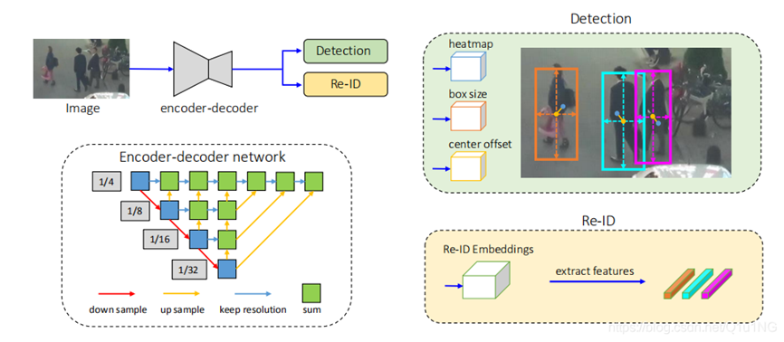
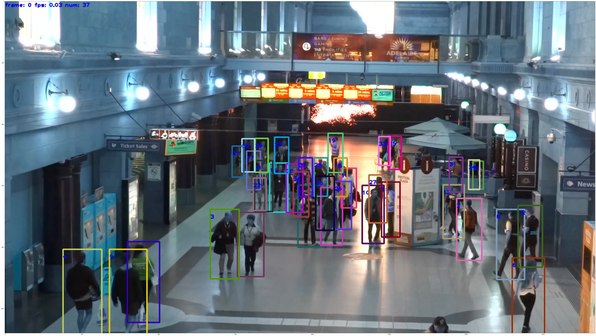

# FairMOT-mindspore-jupyter
The mindspore version FairMOT with jupyter notebook.

[中文](README.zh.md)

## Files

1. src, contains code to import and self-supervised pretraining model.
2. fairMOT.ipynb. The whole process for training and testing, the output will be saved to directory.

## Model introduce
FairMOT is a target detection framework proposed by Huazhong University of Science and Technology and Microsoft Research Asia. All FairMOT improvements to previous methods come from the following three viewpoints:
1. Anchors are not friendly to Re-ID, so the anchor-free algorithm should be used.
2. Multi-layer feature fusion should be performed.
3. For the one-shot method, it is better to use a low dimension for the feature vector of Re-ID.

On MOT15, MOT16, MOT17, MOT20 and other datasets, the frame number of 30fps has reached the current SOTA level.
Most of the existing SOTA methods use a two-step approach:
1. The target is detected by the target detection algorithm.
2. The features are obtained through the Re-ID model, and the ID is obtained by comparison.

Although with the development of target detection algorithm and Re-ID in recent years, the two-step method also has obvious performance improvement in target tracking, but the two-step method does not share the feature map of the detection algorithm and Re-ID, so its speed Very slow and difficult to infer at video rates.
With the maturity of the two-step approach, more researchers have begun to study the one-shot algorithm that detects objects and learns Re-ID features at the same time. When the feature map is shared between object detection and Re-ID, it can be greatly reduced. Inference time, but the accuracy will be much lower than the two-step method. Therefore, the author analyzes the one-shot method and improves the general segmentation model process to obtain the following model framework:

The framework is mainly composed of an encoder-decoder network, and the extracted data is used by the latter two networks, so that the network characteristics of detection and Re-ID are common, which can improve efficiency and better effect (compared to other two-step approach)
In the detection network, the three results of heatmap, box size, and center offset can be obtained in turn from the three heads, which are used to use and calculate the loss. For the specific loss calculation formula, please refer to the original paper.

## Method implementation

FairMOT itself does not emphasize the type of model neural network, as long as the encoder-decoder type is satisfied. Here we use HR-Net (the previous paper of the same institution) as the specific model used.

### Dataset
Since there are many datasets used by FairMOT, the specific file structure refers to the [Dataset](https://github.com/Zhongdao/Towards-Realtime-MOT/blob/master/DATASET_ZOO.md).
In the implementation using MindSpore, unlike pytorch, we do not need to inherit the parent class in Mindspore. The implemented dataset class only needs to implement the three functions of init, get_item, and len.
The dataset needs to be passed to GeneratorDataset in mindspore.dataset to use.


```python

class JointDataset:
    """ for training"""

    default_resolution = [1088, 608]
    mean = None
    std = None
    num_classes = 1

    def __init__(self, opt, root, paths, img_size=(1088, 608), augment=False):
        self.opt = opt
        self.img_files = collections.OrderedDict()
        self.label_files = collections.OrderedDict()
        self.tid_num = collections.OrderedDict()
        self.tid_start_index = collections.OrderedDict()
        self.num_classes = 1
        for ds, path in paths.items():
            path = osp.join(root, path)
            with open(path, 'r') as file:
                self.img_files[ds] = file.readlines()
                self.img_files[ds] = [osp.join(root, x.strip()) for x in self.img_files[ds]]
                self.img_files[ds] = list(filter(lambda x: len(x) > 0, self.img_files[ds]))
            self.label_files[ds] = [
                x.replace('images', 'labels_with_ids').replace('.png', '.txt').replace('.jpg', '.txt')
                for x in self.img_files[ds]]
        for ds, label_paths in self.label_files.items():
            max_index = -1
            for lp in label_paths:
                lb = np.loadtxt(lp)
                if np.shape(lb)[0] < 1:
                    continue
                if len(lb.shape) < 2:
                    img_max = lb[1]
                else:
                    img_max = np.max(lb[:, 1])
                if img_max > max_index:
                    max_index = img_max
            self.tid_num[ds] = max_index + 1
        last_index = 0
        for k, v in self.tid_num.items():
            self.tid_start_index[k] = last_index
            last_index += v
        self.nID = int(last_index + 1)  # 多个数据集中总的identity数目
        print('nID', self.nID)
        self.nds = [len(x) for x in self.img_files.values()]  # 图片数量
        print('nds', self.nds)
        self.cds = [sum(self.nds[:i]) for i in range(len(self.nds))]
        print('cds', self.cds)
        self.nF = sum(self.nds)
        self.width = img_size[0]
        self.height = img_size[1]
        self.max_objs = opt.K
        self.augment = augment

        print('=' * 80)
        print('dataset summary')
        print(self.tid_num)
        print('total # identities:', self.nID)
        print('start index')
        print(self.tid_start_index)
        print('=' * 80)

    def __getitem__(self, files_index):

        for i, c in enumerate(self.cds):
            if files_index >= c:
                ds = list(self.label_files.keys())[i]
                start_index = c

        img_path = self.img_files[ds][files_index - start_index]
        label_path = self.label_files[ds][files_index - start_index]
        imgs, labels, img_path = self.get_data(img_path, label_path)
        for i, _ in enumerate(labels):
            if labels[i, 1] > -1:
                labels[i, 1] += self.tid_start_index[ds]

        output_h = imgs.shape[1] // self.opt.down_ratio
        output_w = imgs.shape[2] // self.opt.down_ratio
        num_classes = self.num_classes
        num_objs = labels.shape[0]
        hm = np.zeros((num_classes, output_h, output_w), dtype=np.float32)
        if self.opt.ltrb:
            wh = np.zeros((self.max_objs, 4), dtype=np.float32)
        else:
            wh = np.zeros((self.max_objs, 2), dtype=np.float32)
        reg = np.zeros((self.max_objs, 2), dtype=np.float32)
        ind = np.zeros((self.max_objs,), dtype=np.int32)
        reg_mask = np.zeros((self.max_objs,), dtype=np.int32)
        ids = np.zeros((self.max_objs,), dtype=np.int32)
        bbox_xys = np.zeros((self.max_objs, 4), dtype=np.float32)

        draw_gaussian = draw_msra_gaussian if self.opt.mse_loss else draw_umich_gaussian
        for k in range(min(num_objs, self.max_objs)):
            label = labels[k]
            bbox = label[2:]
            cls_id = int(label[0])
            bbox[[0, 2]] = bbox[[0, 2]] * output_w
            bbox[[1, 3]] = bbox[[1, 3]] * output_h
            bbox_amodal = copy.deepcopy(bbox)
            bbox_amodal[0] = bbox_amodal[0] - bbox_amodal[2] / 2.
            bbox_amodal[1] = bbox_amodal[1] - bbox_amodal[3] / 2.
            bbox_amodal[2] = bbox_amodal[0] + bbox_amodal[2]
            bbox_amodal[3] = bbox_amodal[1] + bbox_amodal[3]
            bbox[0] = np.clip(bbox[0], 0, output_w - 1)
            bbox[1] = np.clip(bbox[1], 0, output_h - 1)
            h = bbox[3]
            w = bbox[2]

            bbox_xy = copy.deepcopy(bbox)
            bbox_xy[0] = bbox_xy[0] - bbox_xy[2] / 2
            bbox_xy[1] = bbox_xy[1] - bbox_xy[3] / 2
            bbox_xy[2] = bbox_xy[0] + bbox_xy[2]
            bbox_xy[3] = bbox_xy[1] + bbox_xy[3]

            if h > 0 and w > 0:
                radius = gaussian_radius((math.ceil(h), math.ceil(w)))
                radius = max(0, int(radius))
                radius = 6 if self.opt.mse_loss else radius
                # radius = max(1, int(radius)) if self.opt.mse_loss else radius
                ct = np.array(
                    [bbox[0], bbox[1]], dtype=np.float32)
                ct_int = ct.astype(np.int32)
                draw_gaussian(hm[cls_id], ct_int, radius)
                if self.opt.ltrb:
                    wh[k] = ct[0] - bbox_amodal[0], ct[1] - bbox_amodal[1], \
                            bbox_amodal[2] - ct[0], bbox_amodal[3] - ct[1]
                else:
                    wh[k] = 1. * w, 1. * h
                ind[k] = ct_int[1] * output_w + ct_int[0]
                reg[k] = ct - ct_int
                reg_mask[k] = 1
                ids[k] = label[1]
                bbox_xys[k] = bbox_xy
        # ret = {'input': imgs, 'hm': hm, 'reg_mask': reg_mask, 'ind': ind, 'wh': wh, 'reg': reg, 'ids': ids,
        # 'bbox': bbox_xys}
        return imgs, hm, reg_mask, ind, wh, reg, ids

    def __len__(self):
        return self.nF

    def get_data(self, img_path, label_path):
        """get data"""
        height = self.height
        width = self.width
        img = cv2.imread(img_path)  # BGR
        if img is None:
            raise ValueError('File corrupt {}'.format(img_path))
        augment_hsv = True
        if self.augment and augment_hsv:
            # SV augmentation by 50%
            fraction = 0.50
            img_hsv = cv2.cvtColor(img, cv2.COLOR_BGR2HSV)
            S = img_hsv[:, :, 1].astype(np.float32)
            V = img_hsv[:, :, 2].astype(np.float32)

            a = (random.random() * 2 - 1) * fraction + 1
            S *= a
            if a > 1:
                np.clip(S, a_min=0, a_max=255, out=S)

            a = (random.random() * 2 - 1) * fraction + 1
            V *= a
            if a > 1:
                np.clip(V, a_min=0, a_max=255, out=V)

            img_hsv[:, :, 1] = S.astype(np.uint8)
            img_hsv[:, :, 2] = V.astype(np.uint8)
            cv2.cvtColor(img_hsv, cv2.COLOR_HSV2BGR, dst=img)
        h, w, _ = img.shape
        img, ratio, padw, padh = letterbox(img, height=height, width=width)
        # Load labels
        if os.path.isfile(label_path):
            labels0 = np.loadtxt(label_path, dtype=np.float32).reshape(-1, 6)

            # Normalized xywh to pixel xyxy format
            labels = labels0.copy()
            labels[:, 2] = ratio * w * (labels0[:, 2] - labels0[:, 4] / 2) + padw
            labels[:, 3] = ratio * h * (labels0[:, 3] - labels0[:, 5] / 2) + padh
            labels[:, 4] = ratio * w * (labels0[:, 2] + labels0[:, 4] / 2) + padw
            labels[:, 5] = ratio * h * (labels0[:, 3] + labels0[:, 5] / 2) + padh
        else:
            labels = np.array([])

        # Augment image and labels
        if self.augment:
            img, labels, _ = random_affine(img, labels, degrees=(-5, 5), translate=(0.10, 0.10), scale=(0.50, 1.20))

        plotFlag = False
        if plotFlag:
            import matplotlib
            matplotlib.use('Agg')
            import matplotlib.pyplot as plt
            plt.figure(figsize=(50, 50))
            plt.imshow(img[:, :, ::-1])
            plt.plot(labels[:, [1, 3, 3, 1, 1]].T, labels[:, [2, 2, 4, 4, 2]].T, '.-')
            plt.axis('off')
            plt.savefig('test.jpg')
            time.sleep(10)

        nL = len(labels)
        if nL > 0:
            # convert xyxy to xywh
            labels[:, 2:6] = xyxy2xywh(labels[:, 2:6].copy())  # / height
            labels[:, 2] /= width
            labels[:, 3] /= height
            labels[:, 4] /= width
            labels[:, 5] /= height
        if self.augment:
            # random left-right flip
            lr_flip = True
            if lr_flip & (random.random() > 0.5):
                img = np.fliplr(img)
                if nL > 0:
                    labels[:, 2] = 1 - labels[:, 2]

        img = np.ascontiguousarray(img[:, :, ::-1])  # BGR to RGB
        img = np.array(img, dtype=np.float32) / 255
        img = img.transpose((2, 0, 1))
        return img, labels, img_path
```
Notice that it need to be feed into GeneratorDataset to create a dataset which can be used in mindspore.

``` python
dataset = JointDataset(opt, dataset_root, train_set_paths, (1088, 608), augment=True)


Ms_dataset = ds.GeneratorDataset(dataset, ['input', 'hm', 'reg_mask', 'ind', 'wh', 'reg', 'ids'],
                                         shuffle=True, num_parallel_workers=4,
                                         max_rowsize=8,
                                        )
```


### Neural network model

The implementation of the network model needs to inherit mindspore.nn.
However, FairMOT requires a very long training time. If you just learn this process, you can directly load the pre-trained model. In addition, the model requires self-supervised pre-training. It is recommended to load directly here. We do not provide pre-training code. You can also download the pytorch file in the original text for conversion. You can use src/utils/pth2ckpt for conversion. [file](src/utils/crowdhuman_dla34_ms.ckpt)
```python
class DLASegConv(nn.Cell):
    """
    The DLA backbone network.

    Args:
        down_ratio(int): The ratio of input and output resolution
        last_level(int): The ending stage of the final upsampling
        stage_levels(list int): The tree height of each stage block
        stage_channels(list int): The feature channel of each stage

    Returns:
        Tensor, the feature map extracted by dla network
    """

    def __init__(self, heads, down_ratio, final_kernel,
                 last_level, head_conv, out_channel=0, is_training=True):
        super(DLASegConv, self).__init__()
        assert down_ratio in [2, 4, 8, 16]
        self.first_level = int(np.log2(down_ratio))
        self.last_level = last_level
        self.is_training = is_training
        self.base = DLA34([1, 1, 1, 2, 2, 1], [16, 32, 64, 128, 256, 512], block=BasicBlock)
        channels = [16, 32, 64, 128, 256, 512]
        scales = [2 ** i for i in range(len(channels[self.first_level:]))]
        # self.dla_up = DLAUp(self.first_level, stage_channels[self.first_level:], last_level)
        self.dla_up = DLAUp(self.first_level, channels[self.first_level:], scales)
        if out_channel == 0:
            out_channel = channels[self.first_level]
        self.ida_up = IDAUp(out_channel, channels[self.first_level:self.last_level],
                            [2 ** i for i in range(self.last_level - self.first_level)])
        self.heads = heads
        for head in self.heads:
            classes = self.heads[head]
            if head_conv > 0:
                if 'hm' in head:
                    conv2d = nn.Conv2d(head_conv, classes, kernel_size=final_kernel, has_bias=True,
                                       bias_init=Constant(-2.19))
                    self.hm_fc = nn.SequentialCell(
                        [nn.Conv2d(channels[self.first_level], head_conv, kernel_size=3, has_bias=True), nn.ReLU(),
                         conv2d])
                elif 'wh' in head:
                    conv2d = nn.Conv2d(head_conv, classes, kernel_size=final_kernel, has_bias=True)
                    self.wh_fc = nn.SequentialCell(
                        [nn.Conv2d(channels[self.first_level], head_conv, kernel_size=3, has_bias=True), nn.ReLU(),
                         conv2d])
                elif 'id' in head:
                    conv2d = nn.Conv2d(head_conv, classes, kernel_size=final_kernel, has_bias=True)
                    self.id_fc = nn.SequentialCell(
                        [nn.Conv2d(channels[self.first_level], head_conv, kernel_size=3, has_bias=True), nn.ReLU(),
                         conv2d])
                else:
                    conv2d = nn.Conv2d(head_conv, classes, kernel_size=final_kernel, has_bias=True)
                    self.reg_fc = nn.SequentialCell(
                        [nn.Conv2d(channels[self.first_level], head_conv, kernel_size=3, has_bias=True), nn.ReLU(),
                         conv2d])
            else:
                if 'hm' in head:
                    self.hm_fc = nn.Conv2d(channels[self.first_level], classes, kernel_size=final_kernel, has_bias=True,
                                           bias_init=Constant(-2.19))
                elif 'wh' in head:
                    self.wh_fc = nn.Conv2d(channels[self.first_level], classes, kernel_size=final_kernel, has_bias=True)
                elif 'id' in head:
                    self.id_fc = nn.Conv2d(channels[self.first_level], classes, kernel_size=final_kernel, has_bias=True)
                else:
                    self.reg_fc = nn.Conv2d(channels[self.first_level], classes, kernel_size=final_kernel,
                                            has_bias=True)

    def construct(self, image):
        """The DLA backbone network."""
        x = self.base(image)
        x = self.dla_up(x)
        y = []
        for i in range(self.last_level - self.first_level):
            y.append(x[i].copy())
        y = self.ida_up(y, 0, len(y))
        hm = self.hm_fc(y[-1])
        wh = self.wh_fc(y[-1])
        feature_id = self.id_fc(y[-1])
        reg = self.reg_fc(y[-1])
        feature = {"hm": hm, "feature_id": feature_id, "wh": wh, "reg": reg}
        return feature

```

### Loss function

The loss function needs to inherit mindspore.nn.Cell,the composite loss we used for training is:
```python
class CenterNetMultiPoseLossCell(nn.Cell):
    """
    Provide pose estimation network losses.

    Args:
        net_config: The config info of CenterNet network.

    Returns:
        Tensor, total loss.
    """

    def __init__(self, opt):
        super(CenterNetMultiPoseLossCell, self).__init__()
        self.crit = FocalLoss()
        # self.crit_wh = RegWeightedL1Loss() if not config.net.dense_hp else nn.L1Loss(reduction='sum')
        self.crit_wh = RegLoss(opt.reg_loss)
        # wh
        self.crit_reg = RegLoss(opt.reg_loss)  # reg_loss = 'l1'
        self.hm_weight = opt.hm_weight  # hm_weight = 1 :loss weight for keypoint heatmaps
        self.wh_weight = opt.wh_weight  # wh_weight = 0.1 : loss weight for bounding box size
        self.off_weight = opt.off_weight  # off_weight = 1 : loss weight for keypoint local offsets
        self.reg_offset = opt.reg_offset  # reg_offset = True : regress local offset

        self.scalar_summary = ops.ScalarSummary()  # store losses scalars

        self.reg_ind = "reg" if self.reg_offset else "wh"

        # define id
        self.emb_dim = opt.reid_dim  # dataset.reid_dim = 128
        self.nID = opt.nID  # nId = 14455
        self.classifier = nn.Dense(self.emb_dim, self.nID).to_float(ms.float16)
        self.IDLoss = nn.SoftmaxCrossEntropyWithLogits(sparse=True, reduction="mean")
        self.emb_scale = math.sqrt(2) * math.log(self.nID - 1)  # fix np
        self.s_det = Parameter(Tensor(-1.85 * np.ones(1), ms.float32))
        self.s_id = Parameter(Tensor(-1.05 * np.ones(1), ms.float32))

        self.normalize = ops.L2Normalize(axis=1)
        self.greater = ops.Greater()
        self.expand_dims = ops.ExpandDims()
        self.tile = ops.Tile()
        self.multiples_1 = (1, 1, 128)
        self.select = ops.Select()
        self.zeros = ops.Zeros()
        self.exp = ops.Exp()
        self.squeeze = ops.Squeeze(0)
        self.TransposeGatherFeature = TransposeGatherFeature()
        self.reshape = ops.Reshape()
        self.reshape_mul = opt.batch_size * opt.K
        self.cast = ops.Cast()
        self.sigmoid = Sigmoid()

    def construct(self, feature, hm, reg_mask, ind, wh, reg, ids):
        """Defines the computation performed."""
        output_hm = feature["hm"]  # FocalLoss()
        output_hm = self.sigmoid(output_hm)

        hm_loss = self.crit(output_hm, hm)
        self.scalar_summary("hm_loss", hm_loss)

        output_id = feature["feature_id"]  # SoftmaxCrossEntropyWithLogits()
        id_head = self.TransposeGatherFeature(output_id, ind)  # id_head=[1,500,128]

        # id_head = id_head[reg_mask > 0]
        cond = self.greater(reg_mask, 0)  # cond=[1,500]
        cond_cast = self.cast(cond, ms.int32)
        expand_output = self.expand_dims(cond_cast, 2)
        tile_out = self.tile(expand_output, self.multiples_1)
        tile_cast = self.cast(tile_out, ms.bool_)
        fill_zero = self.zeros(id_head.shape, ms.float32)  # fill_zero=[1,500,128]
        id_head = self.select(tile_cast, id_head, fill_zero)  # id_head=[1,500,128]

        id_head = self.emb_scale * self.normalize(id_head)  # id_head=[1,500,128]
        # id_head = self.emb_scale * ops.L2Normalize(id_head)

        zero_input = self.zeros(ids.shape, ms.int32)
        id_target = self.select(self.greater(ids, 0), ids, zero_input)  # id_target=[1,500]

        c_out = self.cast(id_head, ms.float16)
        id_output = self.classifier(c_out)  # id_output=[1,500,14455]
        id_output = self.cast(id_output, ms.float32)

        id_loss = self.IDLoss(id_output, id_target)
        self.scalar_summary("id_loss", id_loss)

        output_wh = feature["wh"]  # Regl1Loss
        wh_loss = self.crit_reg(output_wh, reg_mask, ind, wh)
        self.scalar_summary("wh_loss", wh_loss)

        off_loss = 0
        if self.reg_offset and self.off_weight > 0:  # Regl1Loss
            output_reg = feature[self.reg_ind]
            off_loss = self.crit_reg(output_reg, reg_mask, ind, reg)
        self.scalar_summary("off_loss", off_loss)

        det_loss = self.hm_weight * hm_loss + self.wh_weight * wh_loss + self.off_weight * off_loss
        self.scalar_summary("det_loss", det_loss)
        loss = self.exp(-self.s_det) * det_loss + self.exp(-self.s_id) * id_loss + (self.s_det + self.s_id)
        loss *= 0.5

        return loss
```
### Result
Since jupyter can not output video file, we saved photos for each frame to specified folder. To visualize one:

