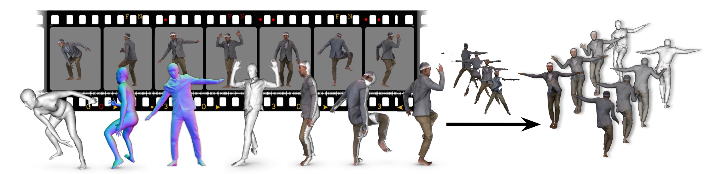
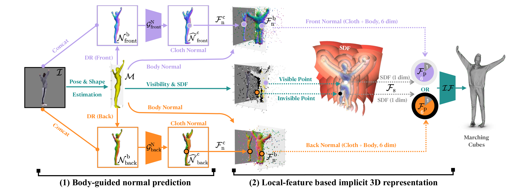
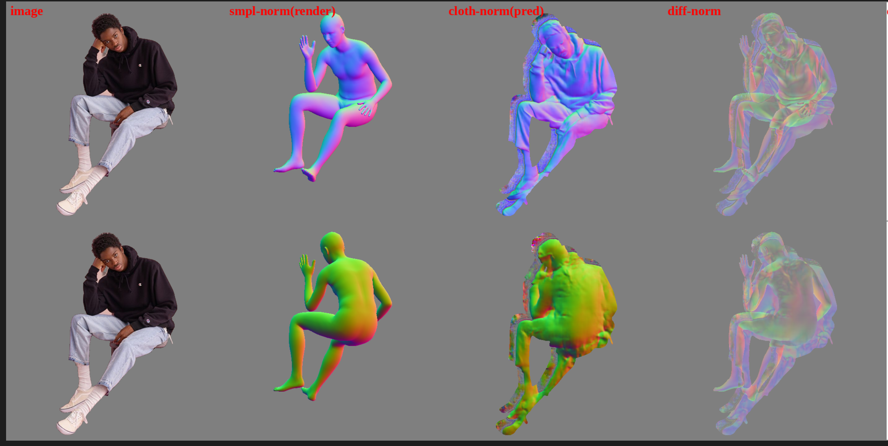

# ICON

-----------

Current methods for learning realistic and animatable 3D
clothed avatars need either posed 3D scans or 2D images
with carefully controlled user poses. In contrast, our goal is
to learn an avatar from only 2D images of people in uncon-
strained poses. Given a set of images, our method estimates
a detailed 3D surface from each image and then combines
these into an animatable avatar. Implicit functions are well
suited to the first task, as they can capture details like hair
and clothes. Current methods, however, are not robust to
varied human poses and often produce 3D surfaces with
broken or disembodied limbs, missing details, or non-human
shapes. The problem is that these methods use global feature
encoders that are sensitive to global pose. To address this,
we propose ICON (“Implicit Clothed humans Obtained from
Normals”), which, instead, uses local features. ICON has
two main modules, both of which exploit the SMPL(-X) body
model. First, ICON infers detailed clothed-human normals
(front/back) conditioned on the SMPL(-X) normals. Second,
a visibility-aware implicit surface regressor produces an
iso-surface of a human occupancy field. Importantly, at in-
ference time, a feedback loop alternates between refining
the SMPL(-X) mesh using the inferred clothed normals and
then refining the normals. Given multiple reconstructed
frames of a subject in varied poses, we use a modified ver-
sion of SCANimate to produce an animatable avatar from
them. Evaluation on the AGORA and CAPE datasets shows that ICON outperforms the state of the art in reconstruc-
tion, even with heavily limited training data. Additionally,
it is much more robust to out-of-distribution samples, e.g.,
in-the-wild poses/images and out-of-frame cropping. ICON
takes a step towards robust 3D clothed human reconstruc-
tion from in-the-wild images. This enables avatar creation
directly from video with personalized pose-dependent cloth
deformation.

[Paper](https://arxiv.org/abs/2112.09127) Yuliang Xiu, Jinlong Yang, Dimitrios Tzionas, Michael J. Black



## Architecture



## Related Repos

ICON: https://github.com/YuliangXiu/ICON

Pytorch3d: https://pytorch3d.org/

Kaolin: https://github.com/NVIDIAGameWorks/kaolin

## Dataset

Please refer to [THuman2.0-Dataset](https://github.com/ytrock/THuman2.0-Dataset) to download the original scans into `data/thuman2/scans`. Then generate `all.txt` by `ls > ../all.txt` under `data/thuman2/scans`, which contains all the subject names (0000~0525).

The SMPL and SMPLX fits could be downloaded as follows:

```bash
wget https://download.is.tue.mpg.de/icon/SMPL+X.zip --no-check-certificate -O ./data/thuman2/SMPL+X.zip
unzip ./data/thuman2/SMPL+X.zip -d ./data/thuman2/
rm ./data/thuman2/SMPL+X.zip
```

`./examples` contains one example of THuman2.0 which shows the data folder structure.

## Code Structure

```text
ICON
├─ README.md
├─ examples # Example images
├─ images # Project images
└─ src
   ├─ apps # Main component
   ├─ configs # Parameter configuration
   └─ iconlib # Dependence library
      ├─ common # Coomon library
      ├─ dataset # Data process
      ├─ net # Main network
      ├─ pymaf # PyMAF network
      └─ smplx # SMPL model

```

## Example

Inference:

1. Download ckpt files into src/data
2. Download J_regressor.npy,lbs_weights.npy,posedirs.npy,shapedirs.npy,v_template.npy into src/
3. run

```bash
   python -m apps.infer -cfg ./configs/icon-filter.yaml -gpu 0 -in_dir ../examples -out_dir ./results -export_video -loop_smpl 10 -loop_cloth 0 -hps_type pymaf
```

The result will show in the src/results:

The one in result will be:

