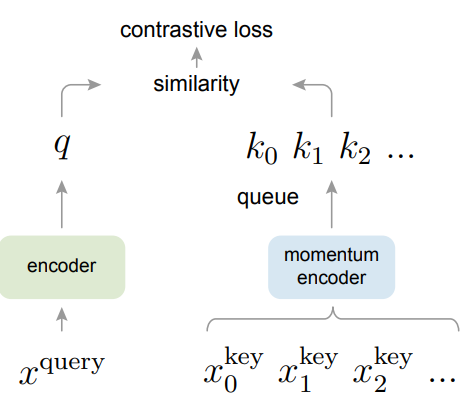
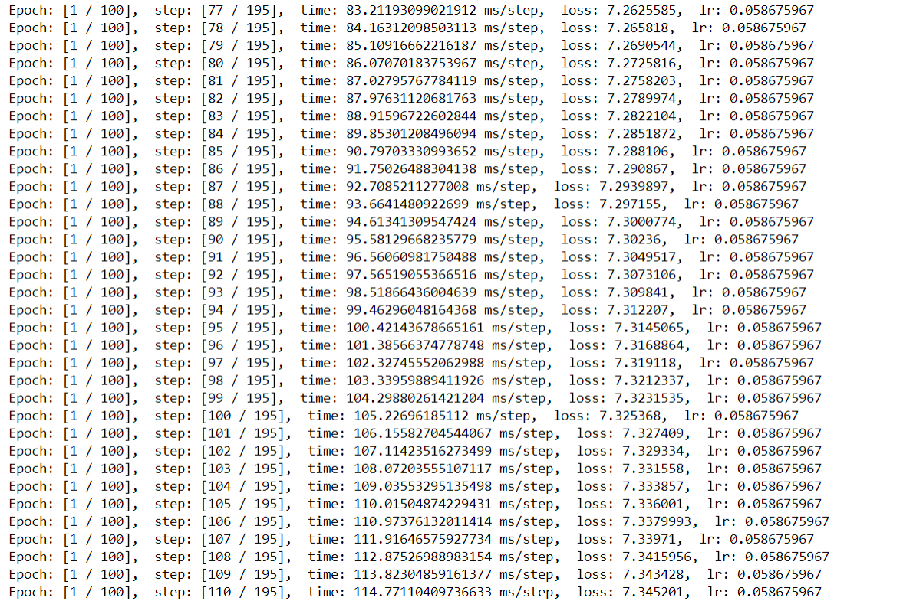
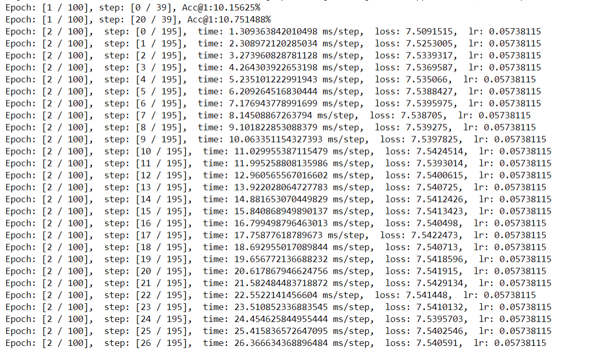

## MoCo: Momentum Contrast for Unsupervised Visual Representation Learning

<p align="center">
  
</p>

MoCo is a mechanism to build a dynamic dictionary for comparative learning, which can be used for various pretext tasks. In this article, we follow a simple example discrimination task: if they are coded views of the same image (for example, different cropping), the query matches a key. Using this excuse task, MoCo shows competitive results under the general protocol of linear classification in Cifar dataset.

## Environment

```python

version python==3.7.13 mindspore==1.7.1 mindvision==0.1.0

```

## Pretrained model

| K    | Acc@1 (ours)                                              | Acc@1 (MoCo paper) |
| ---- | --------------------------------------------------------- | ------------------ |
| 4096 | 33.5 ([model](https://download.mindspore.cn/vision/moco)) | 60.4               |

## Training Parameter description

| Parameter        | Default     | Description                                         |
| ---------------- | ----------- | --------------------------------------------------- |
| arch             | resnet18    | Backbone                                            |
| device_target    | GPU         | Device type                                         |
| dataset          | Cifar10     | Dataset name                                        |
| learning-rate    | 0.06        | Base learning rate                                  |
| epochs           | 200         | Number of epoch                                     |
| schedule         | [120,160]   | learning rate schedule                              |
| batch_size       | 512         | Number of batch size                                |
| wd               | 5e-4        | Weight decay                                        |
| moco-dim         | 128         | Feature dimension                                   |
| moco-k           | 4096        | Number of negative keys                             |
| moco-m           | 0.99        | Moco momentum of updating key encoder               |
| moco-t           | 0.1         | Softmax temperature                                 |
| bn-splits        | 8           | Simulate multi-gpu behavior of BatchNorm in one gpu |
| knn-k            | 200         | K in kNN monitor                                    |
| knn-t            | 0.1         | Softmax temperature in kNN monitor                  |
| resume           | ./checkpoint| Path to save checkpoint                             |
| results-dir      | PATH        | path to cache                                       |

## Example

Here, how to use MOCO model will be introduced as following.

## Dataset

Cifar10 dataset: The CIFAR-10 dataset includes 60000 32*32 color images in 10 categories, with 6000 images in each category. There are 50000 training images and 10000 test images. The dataset is divided into five training batches and one test batch, with 10000 images in each batch. The test batch contains exactly 1000 images randomly selected from each class. Training batches contain the remaining images in random order, but some training batches may contain more images from one class than another. Among them, the training batch contains 5000 pictures from each category.

Cifar100 dataset: This dataset is just like CIFAR-10, except that it has 100 classes, each of which contains 600 images. Each class has 500 training pictures and 100 test pictures. The 100 classes in CIFAR-100 are divided into 20 super-classes. Each image has a "fine" label (the class it belongs to) and a "coarse" label (the superclass it belongs to).

download： [http://www.cs.toronto.edu/ ~Chris/cifar.html](http://www.cs.toronto.edu/ ~Chris/cifar.html)

```text
Cifar10 tree

 /cifar-10-batches-py
     |--- batches.meta/
     |--- data_batch_1/
     |--- data_batch_2/
     |--- data_batch_3/
     |--- data_batch_4/
     |--- data_batch_5/
     |--- test_batch/

```

Cifar100 classification table

| Superclass                     | Classes                                                      |
| ------------------------------ | :----------------------------------------------------------- |
| aquatic                        | mammals beaver, dolphin, otter, seal, whale                  |
| fish                           | aquarium fish, flatfish, ray, shark, trout                   |
| flowers                        | orchids, poppies, roses, sunflowers, tulips                  |
| food                           | containers bottles, bowls, cans, cups, plates                |
| fruit                          | and vegetables apples, mushrooms, oranges, pears, sweet peppers |
| household                      | electrical devices clock, computer keyboard, lamp, telephone, television |
| household                      | furniture bed, chair, couch, table, wardrobe                 |
| insects                        | bee, beetle, butterfly, caterpillar, cockroach               |
| large carnivores               | bear, leopard, lion, tiger, wolf                             |
| large man-made outdoor things  | bridge, castle, house, road, skyscraper                      |
| large natural outdoor scenes   | cloud, forest, mountain, plain, sea                          |
| large omnivores and herbivores | camel, cattle, chimpanzee, elephant, kangaroo                |
| medium-sized mammals           | fox, porcupine, possum, raccoon, skunk                       |
| non-insect invertebrates       | crab, lobster, snail, spider, worm                           |
| people                         | baby, boy, girl, man, woman                                  |
| reptiles                       | crocodile, dinosaur, lizard, snake, turtle                   |
| small mammals                  | hamster, mouse, rabbit, shrew, squirrel                      |
| trees                          | maple, oak, palm, pine, willow                               |
| vehicles 1                     | bicycle, bus, motorcycle, pickup truck, train                |
| vehicles 2                     | lawn-mower, rocket, streetcar, tank, tractor                 |

## Unsupervised Training  and  Evaling

MoCo network understands contrastive learning from another perspective, that is, from the perspective of dictionary query. A dynamic dictionary is built in MoCo, which consists of two parts: a queue and a moving average encoder. The samples in the queue do not need to do gradient reverse transmission, so many negative samples can be stored in the queue, so that the dictionary can become large. The purpose of using the moving average encoder is to keep the sample characteristics in the queue as consistent as possible (that is, different samples obtain the coded representation of the characteristics through the encoder that is as similar as possible). The pseudo code is shown in the following figure.

Backbone is resnet18 ，and  Single GPU simulates the behavior of multiple GPUs. This model supports single GPU and Ascend single card.

```python

python main.py \
  --lr 0.06 \
  --batch_size 256 \
  --epochs 200 \
  --device_target GPU(Ascend)\
```



## Inference Model

```python

python infer.py --device_target GPU(Ascend) --batch_size 256         #Inference

```



## Visualization result

we randomly select an image (in the first row), and then find the most similar/dissimilar images with the largest/smallest dot product (in the second row and third row).

As seen, with unsupervised learning, the model can capture the similarity between images.

## case 1


## case 2


## case 3


