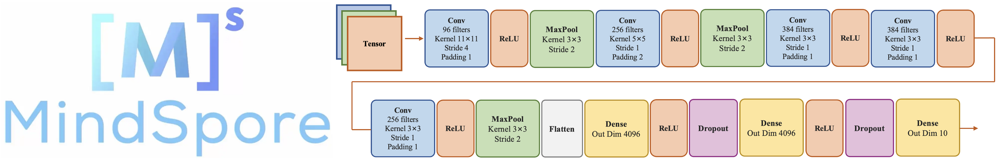

# **基于MindSpore框架的AlexNet案例实现**

    
     
    

  
## **Notebook 内容**
****
### **1 论文讲解**
#### **&emsp;1.1 论文概述**
#### **&emsp;1.2 数据集**
#### **&emsp;1.3 模型讲解**
#### **&emsp;1.4 模型特点**
#### **&emsp;1.5 降低过拟合**
#### **&emsp;1.6 模型参数** 
### **2 案例实现**
#### **&emsp;2.1 环境准备与数据读取**
#### **&emsp;2.2 数据集处理**
#### **&emsp;2.3 模型构建**
#### **&emsp;2.4 训练和测试函数的定义**
#### **&emsp;2.5 模型训练及评估**
#### **&emsp;2.6 模型预测**
### **3 总结**
