# Arbitrary image stylization

Original style transfer with neural networks working on arbitrary painting always suffered from the slow optimization. Subsequent work developed fast artistic style transfer method that may operate in real time, but was limited to one or a limited set of styles.

In this work, a method which combines the flexibility of the neural algorithm of artistic style with the speed of fast style transfer networks to allow real-time stylization using any content/style image pair was implemented. The corresponding publication reveals more details.

[Exploring the structure of a real-time, arbitrary neural artistic stylization network.](https://arxiv.org/pdf/1705.06830.pdf) *Golnaz Ghiasi, Honglak Lee, Manjunath Kudlur, Vincent Dumoulin, Jonathon Shlens*, Proceedings of the British Machine Vision Conference (BMVC), 2017.

## Pretrained model

1. Arbitrary image stylization model pretrained on PNB and DTD training images (for inference). [(ckpt)](https://download.mindspore.cn/vision/arbitrary_image_stylization/ais.ckpt)
2. Trained VGG model checkpoint (for training). [(ckpt)](https://download.mindspore.cn/vision/arbitrary_image_stylization/vgg.ckpt)
3. Trained Inception-v3 checkpoint (for training). [(ckpt)](https://download.mindspore.cn/vision/arbitrary_image_stylization/inception_v3.ckpt)

## Example

Here, how to use Arbitrary image stylization model will be introduced as following.

### Train

To train your own model, you need to have the following:

1. A directory of images to use as style.
2. The ImageNet dataset.
3. A trained VGG model checkpoint.
4. A trained Inception-v3 model checkpoint.

#### Dataset

You can download [Describable Textures Dataset (DTD)](https://www.robots.ox.ac.uk/~vgg/data/dtd/) as style input and [ImageNet dataset](https://image-net.org/download-images.php) as content input. Both datasets are needed as  RGB images and the path is as following:

```text
# ImageNet dataset
.imagenet/
├── train/  (1000 directories and 1281167 images)
   ├── n04347754/
   │   ├── 000001.jpg
   │   ├── 000002.jpg
   │   └── ....
   └── n04347756/
       ├── 000001.jpg
       ├── 000002.jpg
       └── ....
# DTD
.images/ (47 directories and 5640 images)
├── banded/
│   ├── banded_0002.jpg
│   ├── banded_0004.jpg
│   └── ....
└── blotchy/
    ├── blotchy_0003.jpg
    ├── blotchy_0006.jpg
    └── ....
```

#### Training parameter description

| Parameter                   | Default                                                      | Description                                           |
| --------------------------- | ------------------------------------------------------------ | ----------------------------------------------------- |
| batch_size                  | 8                                                            | Number of batch size                                  |
| max_step                    | 100000                                                       | Number of total steps                                 |
| content_path                | /path/to/dataset/imagenet2012/train/                         | Path of content images                                |
| style_path                  | /path/to/dataset/dtd/images/                                 | Path of style images                                  |
| shuffle                     | True                                                         | Shuffle dataset or not                                |
| num_workers                 | 1                                                            | Number of parallel workers                            |
| size                        | 256                                                          | Image size for both content and style                 |
| content_weights             | {"vgg_16/conv3": 1}                                          | Weights for content loss                              |
| style_weights               | {"vgg_16/conv1": 0.5e-3, "vgg_16/conv2": 0.5e-3,<br/>  "vgg_16/conv3": 0.5e-3, 'vgg_16/conv4': 0.5e-3} | Weights for style loss                                |
| style_prediction_bottleneck | 100                                                          | Number of out channels in prediction bottleneck layer |
| vgg_ckpt                    | /path/to/ckpt/vgg.ckpt                                       | Path of trained vgg checkpoint                        |
| inception_v3_ckpt           | /path/to/ckpt/inception_v3.ckpt                              | Path of trained inception_v3 checkpoint               |
| learning_rate               | 1e-5                                                         | Base learning rate                                    |
| output                      | ./result/                                                    | Directory to save checkpoint                          |
| save_checkpoing_step        | 10000                                                        | Interval step of saving checkpoint                    |
| device_id                   | 0                                                            | Device ID                                             |
| device_target               | GPU                                                          | Target device type                                    |

#### Train model

Run the train.py and replace parameters with your own value.

```bash
python train.py --content_path /path/to/dataset/imagenet2012/train/ \
                --style_path /path/to/dataset/dtd/images/ \
                --vgg_ckpt /path/to/ckpt/vgg.ckpt \
                --inception_v3_ckpt /path/to/ckpt/inception_v3.ckpt
```

### Infer

A content image, a style image and a pretrained checkpoint file are needed when inferring.

#### Inferring parameter description

| Parameter    | Default                  | Description                 |
| ------------ | ------------------------ | --------------------------- |
| content_path | ./images/content.jpg     | Path of content image       |
| style_path   | ./images/style.jpg       | Path of style image         |
| ckpt_path    | /path/to/ckpt/model.ckpt | Path of checkpoint          |
| output       | ./result.jpg             | Path to save stylized image |

Run the infer.py and replace parameters with your own value.

```bash
python infer.py --content_path ./images/content.jpg \
                --style_path ./images/style.jpg \
                --ckpt_path /path/to/ckpt/model.ckpt \
                --output ./result.jpg
```

## Result

Each row is generated with the same content image and each column is generated with the same style image.

|                                                              | 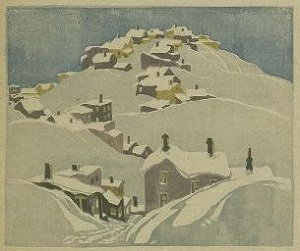                                | 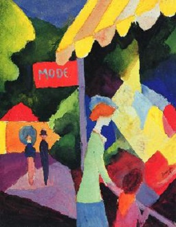                                | 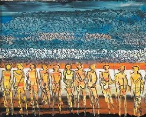                           | 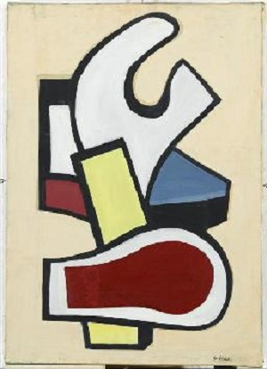                           |
| ------------------------------------------------------------ | ------------------------------------------------------------ | ------------------------------------------------------------ | ------------------------------------------------------------ | ------------------------------------------------------------ |
|        | 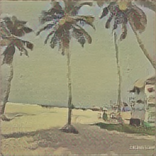 | 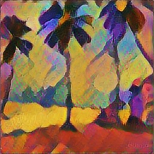 | 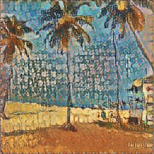 | 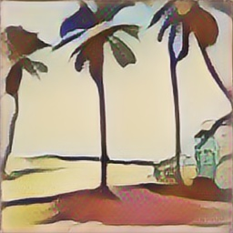 |
|            | 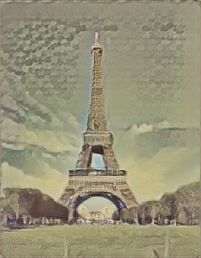 | 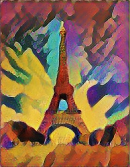 | 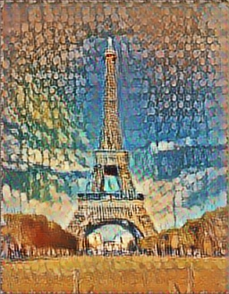 | 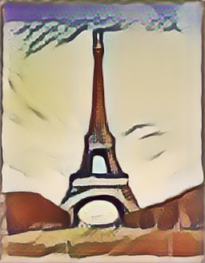 |
|        | 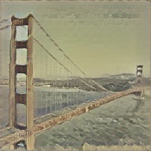 | 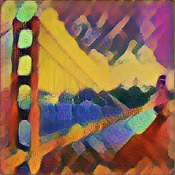 | 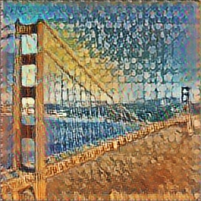 | 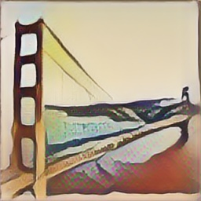 |
|  | 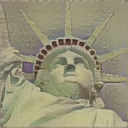 |  | 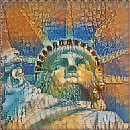 | 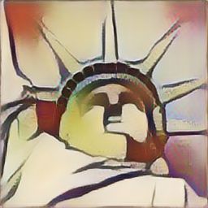 |

