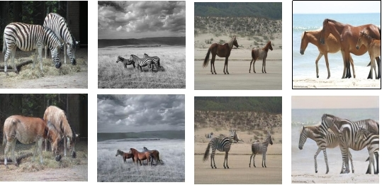
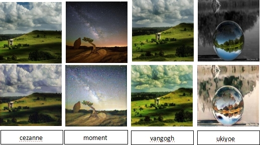
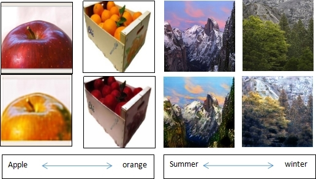

# CycleGAN

***

Image-to-image translation is a visual and image problem. Its goal is to use paired images as a training set and (let the machine) learn the mapping from input images to output images. However, in many tasks, paired training data cannot be obtained. CycleGAN does not require the training data to be paired. It only needs to provide images of different domains to successfully train the image mapping between different domains. CycleGAN shares two generators, and then each has a discriminator.

[Paper](https://arxiv.org/abs/1703.10593): Zhu J Y , Park T , Isola P , et al. Unpaired Image-to-Image Translation using Cycle-Consistent Adversarial Networks[J]. 2017.


## Pretrained model

Model trained by MindSpore, for one style, there are 4 ckpt files.

|  style  |  ckpt  |
| ------- | ------ |
| horse2zebra | [ckpt](https://download.mindspore.cn/vision/cyclegan/horse2zabra) |
| apple2orrange |[ckpt](https://download.mindspore.cn/vision/cyclegan/apple) |
| cezanne2photo |[ckpt](https://download.mindspore.cn/vision/cyclegan/cezanne) |
| momet2photo |[ckpt](https://download.mindspore.cn/vision/cyclegan/moment) |
| vangogh2photo |[ckpt](https://download.mindspore.cn/vision/cyclegan/vangogh) |
| ukiyoe2photo |[ckpt](https://download.mindspore.cn/vision/cyclegan/yoeki) |
| summer2winter_yosemite |[ckpt](https://download.mindspore.cn/vision/cyclegan/summer) |

***

## Dataset

Dataset for training, there are 7 styles.

|  style  |  connection  |
| ------- |  ----------  |
| horse2zebra | [connection](https://people.eecs.berkeley.edu/~taesung_park/CycleGAN/datasets/horse2zebra.zip) |
| apple2orrange |[connection](https://people.eecs.berkeley.edu/~taesung_park/CycleGAN/datasets/apple2orange.zip) |
| cezanne2photo |[connection](https://people.eecs.berkeley.edu/~taesung_park/CycleGAN/datasets/cezanne2photo.zip) |
| momet2photo |[connection](https://people.eecs.berkeley.edu/~taesung_park/CycleGAN/datasets/monet2photo.zip) |
| vangogh2photo |[connection](https://people.eecs.berkeley.edu/~taesung_park/CycleGAN/datasets/vangogh2photo.zip) |
| ukiyoe2photo |[connection](https://people.eecs.berkeley.edu/~taesung_park/CycleGAN/datasets/ukiyoe2photo.zip) |
| summer2winter_yosemite |[connection](https://people.eecs.berkeley.edu/~taesung_park/CycleGAN/datasets/summer2winter_yosemite.zip) |

After downloading dataset, place it in src/data, and unzip it. The structure of folder is as follows:

```markdown
cyclegan/src/data/horse2zebra
├── trainA
├── trainB
├── testA
└── testB
```

## Training Parameter description

| Parameter | Default | Description |
|:-----|:---------|:--------|
| platform | GPU | run platform, only support GPU and Ascend |
| device_id | 0 | device id, default is 0 |
| pool_size | 50 | the size of image buffer that stores previously generated images |
| lr_policy | linear | learning rate policy |
| image_size | 256 | input image_size |
| batch_size | 1 | Number of batch size |
| max_epoch | 200 | epoch size for training |
| ngf | 64 | generator model filter numbers |
| in_planes | 3 | input channels |
| gl_num | 9 | generator model residual block numbers |
| ndf | 64 | discriminator model filter numbers |
| dl_num | 3 | discriminator model residual block numbers |
| outputs_dir | ./outputs | Path to save predicted images |
| outputs_log | ./outputs/log | Path to save logs |
| outputs_ckpt | ./outputs/ckpt | Path to save ckpts |
| outputs_imgs | ./outputs/imgs | Path to save imgs |
| dataroot | ./data/horse2zebra | path of dataset (should have subfolders trainA, trainB, testA, testB, etc) |
| load_ckpt | False | whether load pretrained ckpt |
| g_a_ckpt | ./outputs/ckpt/g_a_200.ckpt | pretrained checkpoint file path of g_a |
| g_b_ckpt | ./outputs/ckpt/g_b_200.ckpt | pretrained checkpoint file path of g_b |
| d_a_ckpt | ./outputs/ckpt/d_a_200.ckpt | pretrained checkpoint file path of d_a |
| d_b_ckpt | ./outputs/ckpt/d_b_200.ckpt | pretrained checkpoint file path of d_b |

## Performance

| Dataset | Resource | Speed | Total time |
|:------- |:---------|:------|:-----------|
| horse2zebra |Ascend 910/NV SMX2 V100-32G|1pc(Ascend): 72.99 ms/step 1pc(GPU): 470 ms/step|1pc(Ascend): 5.5h 1pc(GPU): 35.9h|
| apple2orrange |Ascend 910/NV SMX2 V100-32G|1pc(Ascend): 71.68 ms/step 1pc(GPU): 481 ms/step|1pc(Ascend): 4h 1pc(GPU): 26.8h|
| cezanne2photo |Ascend 910/NV SMX2 V100-32G|1pc(Ascend): 71.61 ms/step 1pc(GPU): 499.57 ms/step|1pc(Ascend): 25h 1pc(GPU): 174.4h|
| momet2photo |Ascend 910/NV SMX2 V100-32G|1pc(Ascend): 70.25 ms/step 1pc(GPU): 504.43 ms/step|1pc(Ascend): 24.5h 1pc(GPU): 175.9h|
| vangogh2photo |Ascend 910/NV SMX2 V100-32G|1pc(Ascend): 71.43 ms/step 1pc(GPU): 502.85 ms/step|1pc(Ascend): 24.5h 1pc(GPU): 172.5h|
| ukiyoe2photo |Ascend 910/NV SMX2 V100-32G|1pc(Ascend): 69.93 ms/step 1pc(GPU): 532.99 ms/step|1pc(Ascend): 24.5h 1pc(GPU): 186.7h|
| summer2winter_yosemite |Ascend 910/NV SMX2 V100-32G|1pc(Ascend): 69.13 ms /step 1pc(GPU): 952.50 ms/step|1pc(Ascend): 4.8h 1pc(GPU): 65.1h|

## Examples

***

### Train

- The following configuration uses 1 GPUs for training. We select horse2zebra.zip. The image input size is set to 256.

  ```shell
  python train.py --platform GPU --dataroot ./data/horse2zebra --outputs_log ./outputs/log --outputs_ckpt ./outputs/ckpt --outputs_imgs ./outputs/imgs
  ```

  output:

  ```text
  Epoch[1] [100/1334] step cost: 323.63 ms, G_loss: 10.88, D_loss:0.67, loss_G_A: 0.34, loss_G_B: 0.54, loss_C_A: 1.65,loss_C_B: 5.06, loss_idt_A: 0.84, loss_idt_B：2.45
  Epoch[1] [200/1334] step cost: 131.31 ms, G_loss: 12.07, D_loss:0.56, loss_G_A: 0.27, loss_G_B: 0.18, loss_C_A: 2.07,loss_C_B: 5.78, loss_idt_A: 0.86, loss_idt_B：2.91
  Epoch[1] [300/1334] step cost: 130.52 ms, G_loss: 10.03, D_loss:0.56, loss_G_A: 0.37, loss_G_B: 0.51, loss_C_A: 3.41,loss_C_B: 2.74, loss_idt_A: 1.68, loss_idt_B：1.31
  Epoch[1] [400/1334] step cost: 129.36 ms, G_loss: 8.24, D_loss:0.59, loss_G_A: 0.26, loss_G_B: 0.45, loss_C_A: 2.60,loss_C_B: 2.48, loss_idt_A: 1.36, loss_idt_B：1.09
  Epoch[1] [500/1334] step cost: 129.56 ms, G_loss: 5.82, D_loss:0.52, loss_G_A: 0.32, loss_G_B: 0.36, loss_C_A: 1.83,loss_C_B: 1.75, loss_idt_A: 0.86, loss_idt_B：0.71
  ...
  ```  

### infer

- The following configuration for infer.

  ```shell
  python infer.py --platform GPU --dataroot ./data/horse2zebra --g_a_ckpt ./outputs/ckpt/g_a_200.ckpt --g_b_ckpt ./outputs/ckpt/g_b_200.ckpt --outputs_dir ./outputs
  ```

  output:

  ```text
  ==========start predict A to B===============
  save fake_B at ./outputs/predict/fake_B/n02381460_9240.jpg
  total 120 imgs cost 18269.25 ms, per img cost 152.24
  ==========end predict A to B===============

  ==========start predict B to A===============
  save fake_A at ./outputs/predict/fake_A/n02391049_10100.jpg
  total 140 imgs cost 4170.92 ms, per img cost 29.79
  ==========end predict B to A===============

  ```  

  result:

  

- There are other styles infer result:
  Art style:

  

  Weather and fruit:

  