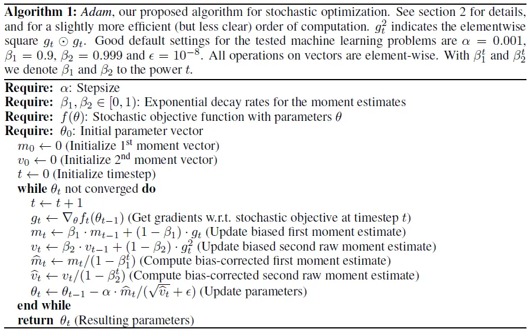
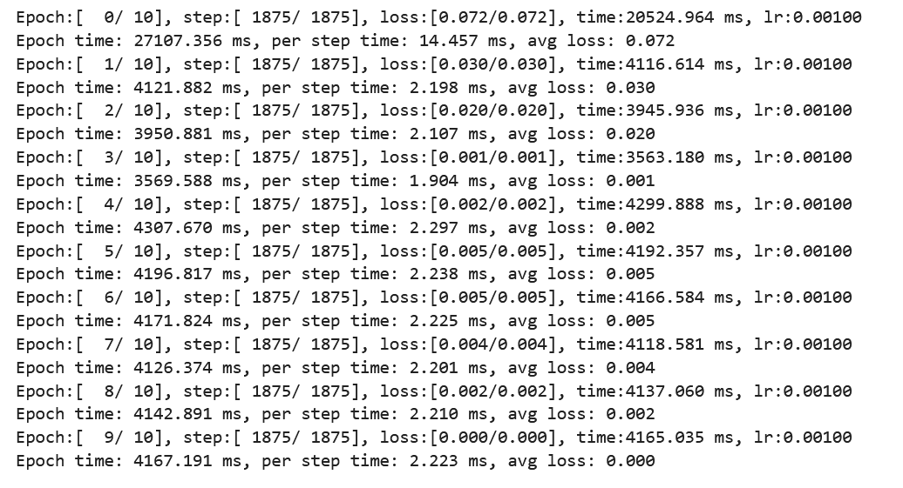
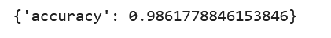
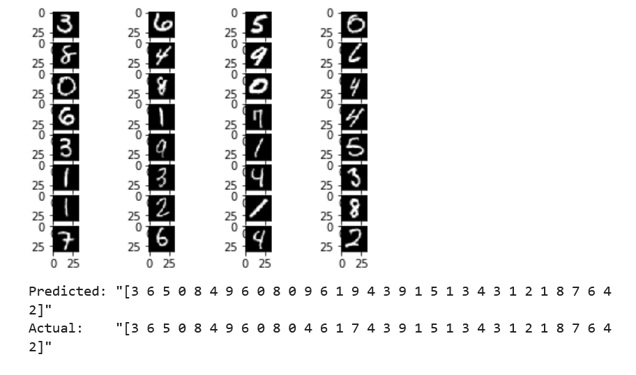

# 基于MindSpore框架的Adam优化器案例实现

## 1 Adam优化器简介
最优化问题是计算数学中最为重要的研究方向之一。而在深度学习领域，优化算法的选择也是一个模型的重中之重。即使在数据集和模型架构完全相同的情况下，采用不同的优化算法，也很可能导致截然不同的训练效果。梯度下降是目前神经网络中使用最为广泛的优化算法之一。为了弥补朴素梯度下降的种种缺陷，研究者们发明了一系列变种算法，从最初的 SGD (随机梯度下降) 逐步演进到 NAdam, 本文将着重介绍Adam优化器。   

2014年12月，Kingma和Lei Ba两位学者在《ADAM: A METHOD FOR STOCHASTIC OPTIMIZATION》一文中提出了Adam优化器。Adam是一种有效的随机优化方法，只需要一阶梯度，内存需求很少。该方法根据梯度的一阶矩（First Moment Estimation，即梯度的均值）和二阶矩（Second Moment Estimation，即梯度的未中心化的方差）的估计计算不同参数的个体自适应学习率； Adam 这个名字来源于自适应矩估计。Adam优化方法方法旨在结合两种流行的方法的优点：AdaGrad (Duchi et al., 2011)，适用于稀疏梯度，和 RMSProp (Tieleman & Hinton, 2012)，适用于在线和非固定设置。

### 1.1 Adam算法介绍

<center>
    
    <br>
    <div style="color:orange;
    display: inline-block;
    color: #999;
    padding: 2px;"></div>
</center>
a） 算法输入︰学习率α；分别作为梯度的一阶和二阶指数移动加权衰减率 $β_{1}$（默认为0.9）、 $β_{2}$（默认为0.999）；模型参数θ的损失函数f（θ），ε表示数值计算稳定性参数，一般取一个很小的浮点数，为了防止分母为0（默认为 $10^{-8}$ ）。

b） 初始化：梯度的一阶指数移动加权平均 $m_{t}$（初始化为0）和二阶指数移动加权平均 $v_{t}$（初始化为0）， $m_{t}$ 是对到目前为止 $g_{t}$ 的一阶原点距E[ $g_{t}$ ]的有偏估计， $v_{t}$ 是对到目前为 $g_{t}$ 的二阶原点距估计E[ $g_{t}^2$ ]的有偏估计。

c） 迭代：不断进行梯度下降，直到参数 $θ_{t}$ 收敛。

其中梯度下降过程： 1）计算第t轮迭代的梯度 $g_{t}$ ，
$$g_{t} =\nabla_{θ}f_{t}(θ_{t-1}) $$ 

更新 $m_{t}$ 、 $v_{t}$ :

$$ m_{t}= β_{1}*m_{t-1}+(1-β_{1})*g_{t} $$ 

$$ v_{t}= β_{2}*v_{t-1}+(1-β_{1})*g_{t}^2 $$ 

2）在迭代初期， $m_{t} $对E[ $g_{t}$ ]的估计以及 $v_{t}$ 对E[ $g_{t}^2$ ]的估计都是有偏的，需要进行偏差修正，修正系数分别是 $\cfrac{1}{1-β_{1}^t}$ 和 $\cfrac{1}{1-β_{2}^t}$ ，随着迭代的进行，估计逐渐变为无偏估计，修正强度逐渐降低为1。

$$\widehat{m_{t}}=  \cfrac{m_{t}}{1-β_{1}^t}$$ 

$$\widehat{v_{t}}=  \cfrac{v_{t}}{1-β_{2}^t}$$ 

3）更新模型参数 $θ_{t}$ : 

$$ θ_{t} =  θ_{t-1}-α\cfrac{m_{t}}{\sqrt[]{v_{t}+ \epsilon}}$$ 

分子表示 $g_{t}$ 在过去一段时间内各分量的平均值，即梯度更新的大致走向，分母表示 $g_{t}$ 在过去一段时间内各分量的平均大小。第一步是确定一个合适的下降方向（即分子项），第二步，对这个选定的方向上的各个子方向做一下微调（分母项），这样，推进较快的子方向会慢下来，推进较慢的子方向会加快速度，结合了Momentum和RMSprop两种算法的优点，动态调整了各个子方向的学习率，。


### 1.2 adam优化器优点
a）惯性保持：Adam算法记录了梯度的一阶矩，即过往所有梯度与当前梯度的平均，使得每一次更新时，上一次更新的梯度与当前更新的梯度不会相差太大，即梯度平滑、稳定的过渡，可以适应不稳定的目标函数。

b）环境感知：Adam记录了梯度的二阶矩，即过往梯度平方与当前梯度平方的平均，这体现了环境感知能力，为不同参数产生自适应的学习速率。

c）超参数，即α， $β_{1}$ ， $β_{2}$ ，ε具有很好的解释性，且通常无需调整或仅需很少的微调。


### 1.3 adam优化器与SGDNesterov,Adagrad比较
通过研究了不同的流行机器学习模型，包括逻辑回归、多层完全连接神经网络和深度卷积神经网络。使用大型模型和数据集， Adam可以有效地解决实际的深度学习问题。
可以使用MNIST数据集调用不同优化器评估逻辑回归模型。可以使用128的小批量大小将Adam与具有Nesterov动量和Adagrad的加速SGD进行了比较。根据图1，我们发现Adam产生了与具有动量的SGD相似的收敛性，并且两者都比Adagra收敛得更快。
<center>
    
    <br>
    <div style="color:orange;
    display: inline-block;
    color: #999;
    padding: 2px;"></div>
</center>
如（Duchi等人，2011）所述，AdagradSGD可以有效地处理稀疏特征和梯度，这是其主要的理论结果之一，而SGD在学习稀有特征方面很低。

## 2 基于Adam的Lenet手写识别案例实现

### **2.1 环境准备与数据读取**

本案例基于MindSpore-CPU版本实现，在CPU上完成模型训练。

MindSpore Vision是一个开源的基于MindSpore框架的计算机视觉研究工具箱，工具所涉及的任务主要包括分类，采用如下命令安装mindvision套件

```python
  !pip install mindvision
  !pip uninstall opencv-python-headless-4.6.0.66
  !pip install "opencv-python-headless<4.3"
```
案例实现所使用的数据即MNIST数据集，可以从http://yann.lecun.com/exdb/mnist/ 中下载，下载好的数据集包括4个文件，分别对应测试集图像、测试集标签、训练集图像、训练集样本，文件路径结构如下：

```
<<<<<<< HEAD
./mnist/
=======
./data/MNIST_Data
>>>>>>> 1314892356a6da07cae3a5e29d06d9bc464d323b
├── test
│   ├── t10k-images-idx3-ubyte
│   └── t10k-labels-idx1-ubyte
└── train
    ├── train-images-idx3-ubyte
    └── train-labels-idx1-ubyte
```
MNIST数据集是由10类28∗28的灰度图片组成。
其中测试集test包括55000张训练图像，5000张验证图像；训练集train包括10000张训练图像。

#### **数据集准备与加载**
```python
<<<<<<< HEAD
from mindvision.dataset import Mnist

# 下载并处理MNIST数据集
download_train = Mnist(path="./mnist", split="train", batch_size=32, repeat_num=1, shuffle=True, resize=32, download=True)

download_eval = Mnist(path="./mnist", split="test", batch_size=32, resize=32, download=True)

dataset_train = download_train.run()
dataset_eval = download_eval.run()
```
=======
fimport os
from mindvision.dataset import DownLoad

#数据集下载路径
dataset_url = "https://mindspore-website.obs.cn-north-4.myhuaweicloud.com/" \
      "notebook/datasets/MNIST_Data.zip"
save_dir = "./data"

#数据集下载
dl = DownLoad()
if not(os.path.exists(save_dir+"/MNIST_Data.zip")):
    dl.download_and_extract_archive(dataset_url, save_dir)
```

```python
from mindvision.dataset import Mnist
from mindspore.dataset import MnistDataset

#数据集下载
# 训练集
dataset_train = MnistDataset(save_dir+"/MNIST_Data/train",shuffle=True) 
# 测试集
dataset_eval = MnistDataset(save_dir+"/MNIST_Data/test",shuffle=True) 
```
```python
import mindspore as ms
from mindspore.dataset import vision, transforms

#数据集处理: datapipe()
def datapipe(dataset, batch_size,usage):
    image_transforms=[
        vision.Resize((32, 32)),
        vision.Rescale(1.0 / 255.0,0),
        vision.HWC2CHW()
    ]

    label_transform = transforms.TypeCast(ms.int32)
    dataset = dataset.map(image_transforms, 'image')
    dataset = dataset.map(label_transform, 'label')
    dataset = dataset.batch(batch_size)

    return dataset
```
```python
#处理数据集
BATCH_SIZE = 32

dataset_train = datapipe(dataset_train,BATCH_SIZE,"train")
dataset_eval = datapipe(dataset_eval,BATCH_SIZE,"test")
```


>>>>>>> 1314892356a6da07cae3a5e29d06d9bc464d323b
### **2.2 模型构建**
Lenet除去输入层共有7层，其中有2个卷积层，2个子采样（pooling）层，3个全连接层，网络模型结构如下图所示。
<center>
    
    <br>
    <div style="color:orange;
    display: inline-block;
    color: #999;
    padding: 2px;"></div>
</center>
根据mindvision提供的lenet网络模型接口，定义network如下：

```python
from mindvision.classification.models import lenet

network = lenet(num_classes=10, pretrained=False)
```

### **2.3 定义损失函数和优化器**

SoftmaxCrossEntropyWithLogits()为mindspore中分类任务的交叉熵损失函数,优化器选择使用nn.adam()，其中训练参数为network.trainable_params()，学习率（lr）取0.001。

```python
import mindspore.nn as nn
# 定义损失函数
net_loss = nn.SoftmaxCrossEntropyWithLogits(sparse=True, reduction='mean')

# 定义优化器函数
net_opt = nn.Adam(network.trainable_params(), learning_rate=0.001)
```
### **2.4 模型训练和保存**
在此处，使用ModelCheckpoint接口用于保存网络模型和参数，以便进行后续的微调操作。

```python
from mindspore.train.callback import ModelCheckpoint, CheckpointConfig

# 设置模型保存参数
config_ck = CheckpointConfig(save_checkpoint_steps=1875, keep_checkpoint_max=10)

# 应用模型保存参数
ckpoint = ModelCheckpoint(prefix="lenet", directory="./lenet", config=config_ck)
```
使用MindSpore提供的model.train接口进行网络的训练，使用mindvision中LossMonitor监控训练过程中loss值的变化。
``` python
from mindvision.engine.callback import LossMonitor
from mindspore.train import Model

# 初始化模型参数
model = Model(network, loss_fn=net_loss, optimizer=net_opt, metrics={'accuracy'})

# 训练网络模型
model.train(10, dataset_train, callbacks=[ckpoint, LossMonitor(0.001, 1875)])
```
<center>
    
    <br>
    <div style="color:orange;
    display: inline-block;
    color: #999;
    padding: 2px;"></div>
</center>

### **2.5 模型评估**
将测试集置于训练好的模型上进行评估，输出的acc为评估的准确率
```python
#模型评估
acc = model.eval(dataset_eval)
#输出准确率
print("{}".format(acc))
```
<center>
    
    <br>
    <div style="color:orange;
    display: inline-block;
    color: #999;
    padding: 2px;"></div>
</center>

### **2.6 模型验证与预测**
```python
import numpy as np
from mindspore import Tensor
import matplotlib.pyplot as plt
import mindspore as ms

# 实例化model类
model = Model(network, loss_fn=net_loss, optimizer=net_opt, metrics={'accuracy'})
<<<<<<< HEAD
# 加载已经保存的用于测试的模型
param_dict = ms.load_checkpoint("./lenet/lenet-1_1875.ckpt")
# 加载参数到网络中
ms.load_param_into_net(network, param_dict)

mnist = Mnist("./mnist", split="test", batch_size=6, resize=32)
dataset_infer = mnist.run()
=======

# 加载已经保存的用于测试的模型
param_dict = ms.load_checkpoint("./lenet/lenet-1_1875.ckpt")

# 加载参数到网络中
ms.load_param_into_net(network, param_dict)

#加载测试集
dataset_infer = MnistDataset(save_dir+"/MNIST_Data/test",shuffle=True) 
dataset_infer = datapipe(dataset_infer,BATCH_SIZE,"test")

>>>>>>> 1314892356a6da07cae3a5e29d06d9bc464d323b
ds_test = dataset_infer.create_dict_iterator()
data = next(ds_test)
images = data["image"].asnumpy()
labels = data["label"].asnumpy()

plt.figure()
for i in range(1, 7):
    plt.subplot(2, 3, i)
    plt.imshow(images[i-1][0], interpolation="None", cmap="gray")
plt.show()

# 使用函数model.predict预测image对应分类
output = model.predict(Tensor(data['image']))
predicted = np.argmax(output.asnumpy(), axis=1)

# 输出预测分类与实际分类
print(f'Predicted: "{predicted}"')
print(f'Actual:    "{labels}"')
```
<center>
<<<<<<< HEAD
    
=======
    
>>>>>>> 1314892356a6da07cae3a5e29d06d9bc464d323b
    <br>
    <div style="color:orange;
    display: inline-block;
    color: #999;
    padding: 2px;"></div>
</center>

## 3、总结 
本案例首先对ADAM优化器做了简单的介绍，讲解了ADAM优化器的基本算法，指出ADAM的优点，并和   SGDNesterov,Adagrad做了比较。然后，我们基于mindspore框架实现了应用ADAM优化器的一个案例——lenet手写识别，通过此案例可以初步掌握MindSpore中ADAM优化器的使用以及实现案例的基本流程，为MindSpore的使用提供支持。
