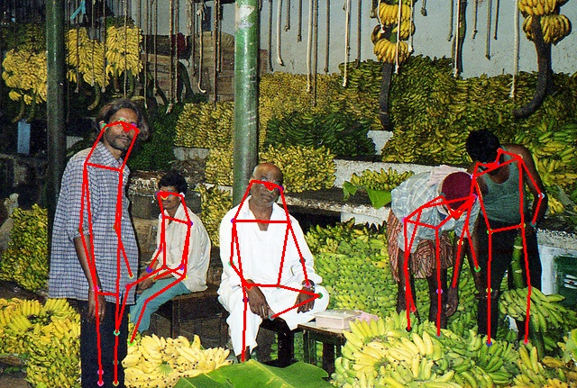
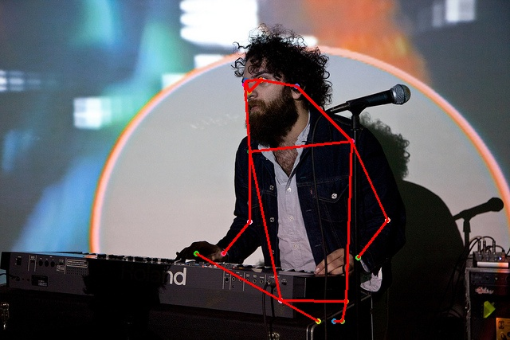
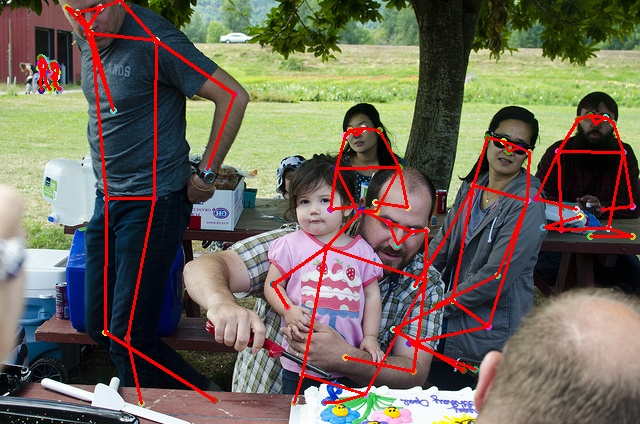
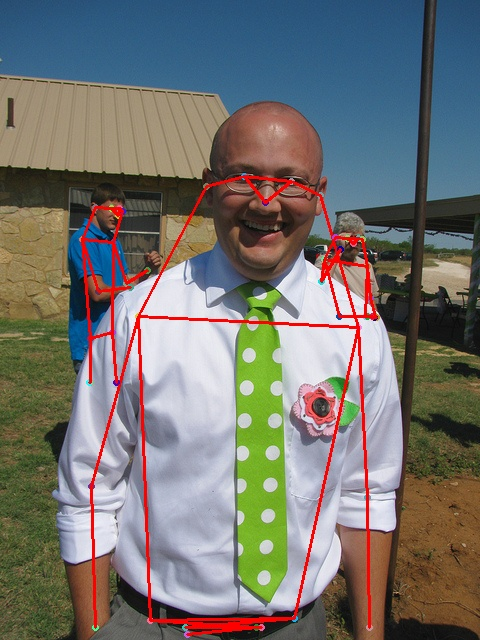

# MSPN

Human Keypoints Detection, also known as human pose estimation, is a relatively basic task in computer vision. Existing human pose recognition models can be broadly classified into two categories based on the different processing stages: Single-stage and Multi-stage, i.e., the models are single-stage or multi-stage; they can also be classified into two categories based on the different order of processing keypoints: Top-Down and Bottom-Up, i.e., first locate the human body and then detect the keypoints or first detect the keypoints and then associate the human body. instances. Human pose recognition, as a precursor task for human action recognition, behavior analysis, human-computer interaction, etc., has attracted numerous companies' business incorporation participation as well as background competition questions in major computer vision competitions. The MSPN model introduced in this paper took the championship in the MS COCO Competition 2018 Keypoints track and achieved excellent detection results on the COCO dataset.

## Pretrained model

Model trained by MindSpore

| model   |input size|AP  |AP<sup>50</sup>|AP<sup>75</sup>|AP<sup>M</sup>|AP<sup>L</sup>|AR  |AR<sup>50</sup>|AR<sup>75</sup>|AR<sup>M</sup>|AR<sup>L</sup>| ckpt                                                                             |
| ------- |----------|----|------|------|-----|-----|----|------|------|-----|-----| -------------------------------------------------------------------------------- |
| MSPN_2_stg |256×192|74.5|90.4|81.2|71.3|80.8|80.1|94.0|85.9|75.9|86.1| [ckpt](https://download.mindspore.cn/vision/mspn/mspn.ckpt) |

Model trained by PyTorch

| model   |input size|AP  |AP<sup>50</sup>|AP<sup>75</sup>|AP<sup>M</sup>|AP<sup>L</sup>|AR  |AR<sup>50</sup>|AR<sup>75</sup>|AR<sup>M</sup>|AR<sup>L</sup>|
| ------- |----------|----|------|------|-----|-----|----|------|------|-----|-----|
| MSPN_2_stg |256×192|74.5|91.2|81.2|70.5|80.4|79.7|94.2|85.6|75.4|85.7|

## Training Parameter description

| Parameter | Default | Description |
|:-----|:---------|:--------|
| num_parallel_workers | 4 | Number of parallel workers |
| device_target | GPU | Device type |
| lr | 5e-4 | Base learning rate |
| min_lr | 0.0 | Min learning rate |
| epoch | 5 | Number of epoch |
| pretrained | True | Whether to load pretrained model |
| batchsize | 62 | Number of batch size |
| stage_num | 2 | Number of Stage |
| img_means | [0.406, 0.456, 0.485] | Image Means for Normalization |
| img_stds | [0.225, 0.224, 0.229] | Image Stds for Normalization |
| keypoint_num | 17 | MSPN Keypoint Num |
| input_shape | [256, 192] | MSPN Input Image Shape |
| output_shape | [64, 48] | MSPN Output Image Shape |
| upsample_channel_num | 256 | MSPN Upsample Channel Num |
| ohkm | True | MSPN Online Hard Keypoint Mining |
| topk | 8 | MSPN OHKM Top-k Hard Keypoint |
| coarse_to_fine | True | MSPN Coarse to Fine Supervision |
| score_thresh | 0.7 | MSPN Keypoints Confidence Score Thresh |

## Example

Here, how to use MSPN model will be introduced as following.

### Dataset

This case uses the MS COCO (2014) dataset as the training set as well as the validation set, please download the corresponding image data files from [MS COCO official website](https://cocodataset.org/#download), and the MS COCO annotation files are stored in . /datasets directory.

Unzip the downloaded datasets and annotation files, the dataset image files can be stored in any path on the device where the runtime environment is located, here it is assumed to be stored in the directory "/data0/coco/coco2014"; the annotation files will be stored in the same directory as the src folder, i.e. ". /The coco2014 folder contains the training and validation images of the MS COCO dataset; the annotation folder contains the det_json and gt_json folders, which contain the annotation files of the human target detection frame and the annotation files of the MS COCO training and validation sets, respectively. and validation sets, respectively.

The annotation path is as following:

```text

.annotation/
    └── det_json
    |    ├── minival_2014_det.json
    |
    └── gt_json
    |    ├── minival_2014.json
    |    └── train_val_minus_minival_2014.json
```

### Model Training

After download the MS COCO Image Dataset and put them in the path you like, you can start training by running the following command:

```shell
python train.py --data_url [YOUR MS COCO PATH] --pretrained_path ./mspn.ckpt --ckpt_save_path ./mspn_new.ckpt
```

output:

```text
loading annotations into memory...
Done (t=7.31s)
creating index...
index created!
epoch: 1 step: 1, loss is 169.18812561035156
epoch: 1 step: 2, loss is 188.10867309570312
epoch: 1 step: 3, loss is 176.26483154296875
epoch: 1 step: 4, loss is 182.11126708984375
......
```

### Model Evaluation

After training, you can start evaluation by running the following command:

```text
python eval.py --data_url [YOUR MS COCO PATH] --ckpt_path ./mspn_new.ckpt
```

output:

```text
loading annotations into memory...
Done (t=7.06s)
creating index...
index created!
......
Average Precision  (AP) @[ IoU=0.50:0.95 | area=   all | maxDets= 20 ] = 0.745
Average Precision  (AP) @[ IoU=0.50      | area=   all | maxDets= 20 ] = 0.904
Average Precision  (AP) @[ IoU=0.75      | area=   all | maxDets= 20 ] = 0.812
Average Precision  (AP) @[ IoU=0.50:0.95 | area=medium | maxDets= 20 ] = 0.713
Average Precision  (AP) @[ IoU=0.50:0.95 | area= large | maxDets= 20 ] = 0.808
Average Recall     (AR) @[ IoU=0.50:0.95 | area=   all | maxDets= 20 ] = 0.801
Average Recall     (AR) @[ IoU=0.50      | area=   all | maxDets= 20 ] = 0.940
Average Recall     (AR) @[ IoU=0.75      | area=   all | maxDets= 20 ] = 0.859
Average Recall     (AR) @[ IoU=0.50:0.95 | area=medium | maxDets= 20 ] = 0.759
Average Recall     (AR) @[ IoU=0.50:0.95 | area= large | maxDets= 20 ] = 0.861
```

### Model Inference

Since MSPN is a Top-Down model, i.e., the human detection frame needs to be detected first before the key point detection of each detection frame, so MSPN model inference needs to provide additional human detection frame annotation JSON files for the images to be inferred, and the annotation format of individual detection frames is shown below:

```json
{
    "category_id": 1,
    "image_id": 398905,
    "bbox": [
        216.39,
        32.29,
        295.74,
        333.67
    ],
    "score": 0.9951
}
```

- category_id：Constant to 1 in MSPN, consistent with the pedestrian labeling label of MS COCO Detection.
- image_id：File name ID of the image to be inferred.
- bbox：The dimensional information of the inspection frame, XYHW, indicates the horizontal and vertical coordinates of the upper left corner point, the length and width of the inspection frame, respectively.
- score：Confidence level of the detection frame.

Change the name of the image to be inferred to a plain numeric file name not starting with 0 and place it in . /infer_img folder; place the JSON file of the detection frame information of the image to be inferred in the . /annotation/det_json folder. Multiple images can be stored at the same time in . /infer_img file, but make sure that the image_id in the annotation JSON file must be the same as the one in . /infer_img folder.

With all of this above done, you can start inferring by running the following command:

```shell
python infer.py --ckpt_path ./mspn_new.ckpt --score_thresh 0.7
```

### **Results**







