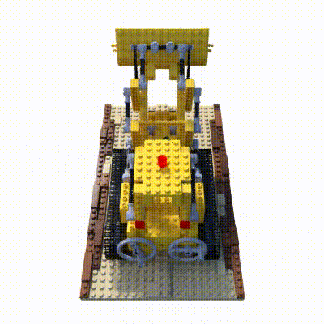

# NeRF

A [neural radiance field](https://arxiv.org/abs/2003.08934) (NeRF) is a fully-connected neural network that can generate novel views of complex 3D scenes, based on a partial set of 2D images. It is trained to use a rendering loss to reproduce input views of a scene. It works by taking input images representing a scene and interpolating between them to render one complete scene. NeRF is a highly effective way to generate images for synthetic data.

A NeRF network is trained to map directly from viewing direction and spatial location (5D input) to opacity and color (4D output), using volume rendering to render new views. NeRF is a computationally-intensive algorithm, and processing of complex scenes can take hours or days. However, new algorithms are available that dramatically improve performance.

## Environment

```shell
pip install tqdm==4.64.0 configargparse==1.5.3 imageio==2.19.3 opencv-python==4.6.0.66
```

## Pretrained Model

Lego:

- Coarse: 192 pts/ray: [ckpt](https://download.mindspore.cn/vision/nerf/lego/200000.blender_lego_coarse_0.ckpt)

- Coarse: 64 pts/ray + Fine: 128 pts/ray: [ckpt](https://download.mindspore.cn/vision/nerf/lego/200000.blender_lego_0.ckpt)

Fern:

- Coarse: 192 pts/ray: [ckpt](https://download.mindspore.cn/vision/nerf/fern/200000.llff_fern_coarse_0.ckpt)

- Coarse: 64 pts/ray + Fine: 128 pts/ray: [ckpt](https://download.mindspore.cn/vision/nerf/fern/200000.llff_fern_0.ckpt)

### Performance

| Lego                                                          | Speed        | PSNR ↑ | SSIM ↑ | LPIPS ↓   |
| ------------------------------------------------------------- | ------------ | ------ | ------ | --------- |
| Coarse: 192 pts/ray (torch converted ckpt)                    | 13.37s/img   | 30.52  | 0.9565 | **0.032** |
| Coarse: 192 pts/ray (Train from scratch)                      | 13.37s/img   | 28.16  | 0.9233 | 0.055     |
| Coarse: 64 pts/ray + Fine: 128 pts/ray (torch converted ckpt) | 1305.28s/img | N/A     | N/A     | N/A        |
| Coarse: 64 pts/ray + Fine: 128 pts/ray (Train from scratch)   | 1305.28s/img | N/A     | N/A     | N/A        |
| Paper: 64 pts/ray + Fine: 128 pts/ray                         | 4.69s/img    | 32.54  | 0.961  | 0.050     |

| Fern                                                          | Speed        | PSNR ↑    | SSIM ↑     | LPIPS ↓   |
| ------------------------------------------------------------- | ------------ | --------- | ---------- | --------- |
| Coarse: 192 pts/ray (torch converted ckpt)                    | 13.37s/img   | **26.06** | **0.8305** | **0.095** |
| Coarse: 192 pts/ray (Train from scratch)                      | 13.37s/img   | 25.43     | 0.7963     | 0.121     |
| Coarse: 64 pts/ray + Fine: 128 pts/ray (torch converted ckpt) | 1305.28s/img | N/A        | N/A         | N/A        |
| Coarse: 64 pts/ray + Fine: 128 pts/ray (Train from scratch)   | 1305.28s/img | N/A        | N/A         | N/A        |
| Paper: 64 pts/ray + Fine: 128 pts/ray                         | 4.69s/img    | 25.17     | 0.792      | 0.280     |

Note: the significant speed drop comes from the unsupported N-dim `ms.numpy.searchsorted` that instead implemented with a for loop. Related [issue](https://gitee.com/mindspore/mindspore/issues/I5CWTR?from=project-issue).

## Training Parameter Description

Please check out the [config script](src/utils/config.py).

## Example

Here, how to use NeRF model will be introduced as following.

### Dataset

At first, you should download dataset by yourself. [NeRF Synthetics](https://drive.google.com/file/d/18JxhpWD-4ZmuFKLzKlAw-w5PpzZxXOcG/view?usp=sharing).

After you get the dataset, make sure your path is sturctured as following:

```text
.datasets/
└── nerf_synthetics
    └── lego
        ├── test [600 entries exceeds filelimit, not opening dir]
        ├── train [100 entries exceeds filelimit, not opening dir]
        ├── transforms_test.json
        ├── transforms_train.json
        ├── transforms_val.json
        └── val [100 entries exceeds filelimit, not opening dir]
```

and modify the `datadir` in the [config file](src/configs/lego.txt) accordingly.

### Train/Evaludate/Inference Model

```shell
python {train,eval}.py [data_related_options] \
[--ckpt /path/to/checkpoint] [--no_reload] [--gpu 0] \
[--render_test]
# `--no_reload`: not resume from last run.
# `--gpu`: the used gpu.
# `--ckpt`: specify the path of a checkpoint (from trained or downloaded).
# `--render_test`: render test images to perform quantitative comparison.
```

#### Fern coarse

```shell
python {train,eval}.py --name fern_coarse --data_dir ../datasets/nerf_llff/fern/ --dataset_type llff --factor 8 --llff_hold 8 --cap_n_rand 4096 --cap_n_samples 192 --cap_n_importance 0 --use_view_dirs --raw_noise_std 1e0 [--ckpt /path/to/checkpoint]
```

#### Fern full

Note: the significant speed drop comes from the unsupported N-dim `ms.numpy.searchsorted` that instead implemented with a for loop. Related [issue](https://gitee.com/mindspore/mindspore/issues/I5CWTR?from=project-issue).

```shell
python {train,eval}.py --name fern --data_dir ../datasets/nerf_llff/fern/ --dataset_type llff --factor 8 --llff_hold 8 --cap_n_rand 4096 --cap_n_samples 64 --cap_n_importance 128 --use_view_dirs --raw_noise_std 1e0 [--ckpt /path/to/checkpoint]
```

#### Lego coarse

```shell
python {train,eval}.py --name lego_coarse --data_dir ../datasets/nerf_synthetics/lego --dataset_type blender --half_res --cap_n_rand 4096 --cap_n_samples 192 --cap_n_importance 0 --use_view_dirs --raw_noise_std 1e0 --white_bkgd [--ckpt /path/to/checkpoint]
```

#### Lego full

Note: the significant speed drop comes from the unsupported N-dim `ms.numpy.searchsorted` that instead implemented with a for loop. Related [issue](https://gitee.com/mindspore/mindspore/issues/I5CWTR?from=project-issue).

```shell
python {train,eval}.py --name lego --data_dir ../datasets/nerf_synthetics/lego --dataset_type blender --half_res --cap_n_rand 4096 --cap_n_samples 64 --cap_n_importance 128 --use_view_dirs --raw_noise_std 1e0 --white_bkgd [--ckpt /path/to/checkpoint]
```

### Results


