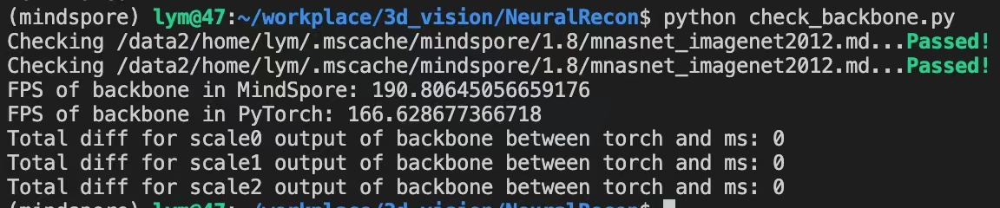

# NeuralRecon

***

NeuralRecon is a novel framework named for real-time 3D scene reconstruction from a monocular video. Unlike previous methods that estimate single-view depth maps separately on each key-frame and fuse them later, it's proposed to directly reconstruct local surfaces represented as sparse TSDF volumes for each video fragment sequentially by a neural network. A learning-based TSDF fusion module based on gated recurrent units is used to guide the network to fuse features from previous fragments. This design allows the network to capture local smoothness prior and global shape prior of 3D surfaces when sequentially reconstructing the surfaces, resulting in accurate, coherent, and real-time surface reconstruction. The experiments on ScanNet and 7-Scenes datasets show that the system outperforms state-of-the-art methods in terms of both accuracy and speed. This is the first learning-based system that is able to reconstruct dense coherent 3D geometry in real-time.

[Paper](https://arxiv.org/pdf/2104.15838.pdf): Sun J M, Xie Y M, Chen L H, Zhou X W, Bao H J, et al. NeuralRecon: Real-Time Coherent 3D Reconstruction from Monocular Video[J]. 2021.


## Relevant Repos

NeuralRecon: https://github.com/zju3dv/NeuralRecon

torchsparse: https://github.com/mit-han-lab/torchsparse

***

## Dataset

Download the [pretrained weights](https://drive.google.com/file/d/1zKuWqm9weHSm98SZKld1PbEddgLOQkQV/view?usp=sharing) on Scannet and put it under `PROJECT_PATH/checkpoints`.

7-Scenes: https://www.microsoft.com/en-us/research/project/rgb-d-dataset-7-scenes/

ScanNet: https://github.com/ScanNet/ScanNet

For ScanNet dataset, you can obtain the train/val/test split information from [here](https://github.com/ScanNet/ScanNet/tree/master/Tasks/Benchmark).

Download the [sense reader](https://github.com/ScanNet/ScanNet/tree/master/SensReader) for Scannet and put it under `src`.

Expected directory structure of ScanNet:

```text
DATAROOT
└───scannet
│   └───scans
│   |   └───scene0000_00
│   |       └───color
│   |       │   │   0.jpg
│   |       │   │   1.jpg
│   |       │   │   ...
│   |       │   ...
│   └───scans_test
│   |   └───scene0707_00
│   |       └───color
│   |       │   │   0.jpg
│   |       │   │   1.jpg
│   |       │   │   ...
│   |       │   ...
|   └───scannetv2_test.txt
|   └───scannetv2_train.txt
|   └───scannetv2_val.txt
```

***

## Code Structure

```text
# *_ms.py means MindSpore version of the codes
# *_dense.py means PyTorch dense version of the models

neuralrecon
└───README.md
└───assets
└───src
│   └───config                  # parameter configuration
│   └───datasets                # data preprocessing
│   └───models                  # network definition
│   └───ops                     # options for model training
│   └───SensReader              # tools to extract ScanNet .sens files
│   └───tools                   # some useful tool functions
│   │   └───tsdf_fusion         # generate tsdf labels for ScanNet
│   └───train_utils             # utils for training with MindSpore
│   └───download_scannet.py     # script to download ScanNet dataset
│   └───main_dense.py           # run the dense version of NeuralRecon
│   └───main_ms.py              # the training code with MindSpore
│   └───main.py                 # run the sparse version of NeuralRecon
|   └───check_backbone.py       # Compare the outputs of backbone
│   └───test_datasets_ms.py     # test mindspore dataset
│   └───utils.py                # utils for running in PyTorch
|   └───*.sh                    # some scripts
```

***

## Convert pretrained weights of backbone2d to MindSpore

Download the [pretrained weights of NeuralRecon](https://drive.google.com/file/d/1zKuWqm9weHSm98SZKld1PbEddgLOQkQV/view?usp=sharing) and put it under `src/checkpoints`. Then run the scripts:

```python
# Convert pretrained weights (in src/models)
python torch_backbone_to_ms.py
# Compare the output of backbone between torch/ms version
python check_backbone.py
```

The comparison of performance and results between torch and ms:
