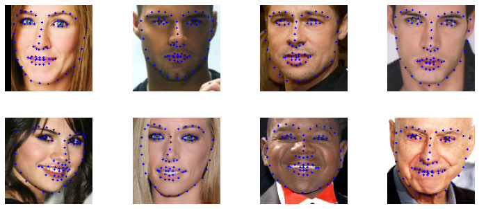

# PFLD

Face key point detection is a very core algorithm business, which has been applied in many scenes. For example, the face change, makeup change, face recognition and other functions in 2C app that we commonly use need to detect the key points of the face first, and then carry out other algorithm business processing; In some 2B business scenarios, such as the estimation of face posture during fatigue driving, you can also detect the key points of the face first, then estimate the 2D to 3D, and finally calculate the pose angle of the face relative to the camera. Pfld algorithm can get good results on common face key point detection data sets with a very small network model.

## Pretrained model

Model trained by MindSpore:

| model   |nme | ion |ipn| ckpt                                                                             |
| ------- |----|-----|---| -------------------------------------------------------------------------------- |
| PFLD1X_68_points |0.0583|0.6232|0.3489| [ckpt](https://download.mindspore.cn/vision/pfld/PFLD1X_300W.ckpt) |
| PFLD1X_98_points |0.0873|0.9828|1.5889|[ckpt](https://download.mindspore.cn/vision/pfld/PFLD1X_WFLW.ckpt) |

Model trained by PyTorch:

| model   |nme | ion |ipn|
| ------- |----|-----|---|
| PFLD1X_68_points |0.0454|0.6289|0.4482|
| PFLD1X_98_points |0.0693|0.9213|1.2675|

## Training Parameter description

| Parameter            | Default          | Description                            |
|:---------------------|:-----------------|:---------------------------------------|
| workers              | 1                | Number of parallel workers             |
| device_target        | GPU              | Device type                            |
| base_lr              | 0.0001           | Base learning rate                     |
| weight_decay         | 1e-6             | Control weight decay speed             |
| end_epoch            | 100              | Number of epoch                        |
| resume               | True             | Whether to load pretrained model       |
| model_type           | 68_points        | Model type divided by landmark number  |
| target_dataset       | 300W             | Dataset name                           |
| data_preprocess_flag | True             | Whether to perform data pre-processing |
| train_batchsize      | 256              | Number of batch size                   |
| checkpoint_path      | ../checkpoint    | Path to save checkpoint                |
| dataset_file_path    | ../datasets/300W | Path of data set                       |
| pretrain_model_path  | dict             | Save the path of pretrained model      |

## Example

Here, how to use PFLD model will be introduec as following.

### Dataset

At first, you should download dataset by yourself. [WFLW](https://wywu.github.io/projects/LAB/WFLW.html) and [300W](https://ibug.doc.ic.ac.uk/resources/300-W/) dataset is supported.

Attention, for 300W dataset, you only need afw, helen, ibug and lfpw these four datasets. Indoor and outdoor belong to 300W challenge dataset.

And for WFLW dataset, you have to download the dataset images and annotation files, include two folders: **list_98pt_rect_attr_train_test** and **list_98pt_test**.

The Mirror68.txt file and Mirror98.txt file have been provided in our work.

After you get the dataset, make sure your path is as following:

```text

.datasets/
    └── 300W
    |    ├── 300W_annotations
    |    |      └── Mirrors68.txt
    |    └── 300W_images
    |           ├── afw
    |           ├── helen
    |           ├── ibug
    |           └── ifpw
    └── WFLW
    |    ├── WFLW_annotations
    |    |      ├── list_98pt_rect_attr_train_test
    |    |      ├── list_98pt_test
    |    |      └── Mirrors98.txt
    |    └── WFLW_images
    |           ├── 0-Parade
    |           ├── 1-Handshaking
    |           ......
    └── infer_image

```

### Data augmentation and Train Model

Before you start to train the model. Data augmentation is necessary for your dataset and create train data and test data.

After that you will have another two folders in you WFLW folder or 300W folder.

Attention, you can set which dataset you want to do augmentation by setting the **target_dataset** parameter in train.py.

Run the train.py to start to train the model. Through the model_type parameter, you can choose which model you want to train.

For WFLW dataset, you have to use 98 points output model. For 300W dataset, you have to use 68 points output model.

Attention, when you change the dataset, you have to change **target_dataset**, **model_type**, **dataset_file_path** the three parameter.

```shell
python train.py --device_target CPU --target_dataset 300W --model_type 68_points --dataset_file_path ../datasets/300W --data_preprocess_flag True
```

output:

```text
Epoch:[40/40], step:[127/129], loss:[0.709/0.732], time:418.097ms, lr:0.00001
Epoch:[40/40], step:[128/129], loss:[0.739/0.739], time:417.928ms, lr:0.00001
......
Epoch:[40/40], step:[129/129], loss:[0.729/0.734], time:418.322ms, lr:0.00001
```

### Evaluate Model

After training, you can use test set to evaluate the performance of your model.

Run eval.py to achieve this. The usage of model_type parameter is same as training process.

```text
python eval.py --device_target CPU --model_type 68_points --dataset_file_path ../datasets/300W
```

output:

```text
nme:0.0641
ion:0.5747
ipn:0.3195
inference_cost_time: 0.014595
```

### Infer

At last, you can use your own image to test your model. Put your image in the infer_image folder, then run infer.py to do inference.

```shell
python infer.py --device_target CPU --model_type 68_points --infer_data_root ../datasets/infer_image
```

**Result**

