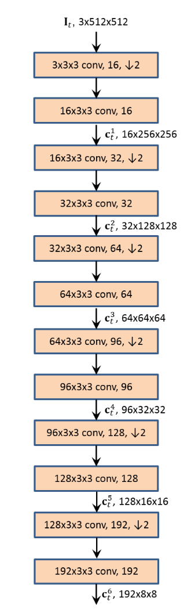

# PWCNet 光流实现案例

## 1. 模型简介

PWC-Net网络是由NVIDIA公司提出的一种基于深度学习的光流估计方法,该论文(["PWC-Net: CNNs for Optical Flow Using Pyramid, Warping, and Cost Volume."]([https://arxiv.org/abs/1709.02371]))发表在CVPR2018中。这里也有其扩展版本(["Models Matter, So Does Training: An Empirical Study of CNNs for Optical Flow Estimation."]([https://arxiv.org/abs/1809.05571]))。

PWC-Net网络的主要贡献在于提出了一种新的光流估计方法，该方法可以在单个网络中同时估计光流和视差，并且可以在不同的尺度上进行估计。

### 1.1 模型结构

PWC-Net网络的结构如下图右方所示：


其网络结构包含三个重要模块：Feature Pyramind、Warping和Cost Volume。

+ Feature Pyramind：该模块的作用是将输入的图像进行下采样，得到不同尺度共计6个尺度（ $16\times256\times256$， $32\times128\times128$， $64\times64\times64$， $96\times32\times32$， $128\times16\times16$， $192\times8\times8$）的特征图，该网络由12层卷积层和附属的非线性激活层组成，具体结构如下图所示.  

+ Warping: 该模块的作用主要是将后一张的特征通过扭曲操作变换到前一张图像的特征上。（由于光流是反映两帧之间像素运动程度，理论上我们可以借助光流将后一帧图像的每个像素点映射回前一帧图像上，如果光流是没有任何偏差的，后一帧映射后的图像就会和前一帧的图像完全一致，因此就可以使用如MSE等一致性损失函数来优化光流估计网络）。其公式如下<br>
$c_w^l=c_2^l(x+up_2(w^{l+1})(x))$<br>
其中 $c^l$ 是代表第 $l$ 层特征， $up_2$ 代表2倍的上采样函数， $x$ 代表像素坐标， $w^{l+1}$ 代表第 $l+1$ 层的光流估计网络的输出， $c_w^l$ 代表扭曲后的特征图。
+ Cost Volume: 该模块的作用是用于计算前一帧图像的像素与其在下一帧的对应像素相关联的数据匹配成本。（由于Warping后的特征图必然和前一帧图像对应的特征图存在差距，因此需要用这个模块来计算并生成两图之间的差异）。其公式如下<br>
$cv^l(x_1,x_2)=\frac{1}{N}(c^l_1(x_1))^{\mathbb{T}}c_w^l(x_2)$<br>
其中 $cv^l$ 代表第 $l$ 层的cost volume， $c^l_1$ 代表第 $l$ 层的前一帧图像的特征图， $c_w^l$ 代表第 $l$ 层的扭曲后的特征图， $x_1$ 代表前一帧图像的像素坐标， $x_2$ 代表后一帧图像的像素坐标， $N$ 代表图像的像素个数。

## 2 模型实现

### 2.1 环境依赖

本项目基于MindSpore 1.8.1版本进行实现，目前在GPU环境下运行正常。
本代码依赖flow_vis库，该库可以通过以下命令行安装
```
pip install flow_vis
```

案例实现所使用的数据包含一种类别数据集，[MPI-Sintel-complete](https://files.is.tue.mpg.de/sintel/MPI-Sintel-complete.zip)。其中使用MPI-Sintel-complete数据集进行训练，使用MPI-Sintel-complete数据集进行验证。如果需要使用MPI-Sintel-complete数据集进行验证，需要将数据集解压后放置在`data`目录下。
```
.data/
├── MPI-Sintel-complete/
│   ├── training/
│   │   ├── final/
│   │   │   ├── ......
│   │   ├── flow/
│   │   │   ├── ......
```

### 2.2 数据集处理
针对以上的数据集，我们使用MindSpore提供的`mindspore.dataset`进行数据处理，具体的数据处理过程如下：
FlyingChairs数据集处理：
```python
import glob
from importlib import invalidate_caches
from operator import le
import os
from re import S
from typing import List, Tuple
import mindspore as m
import mindspore.dataset as d
from mindspore.dataset.transforms.transforms import PyTensorOperation, TensorOperation
import mindspore.dataset.vision as V
import mindspore.dataset.transforms as T
import numpy as np

from src.dataset_utils import (
    RandomGamma,
    TransformsComposeForMultiImages,
    get_father_dir,
    read_data,
)
from src.config import FLYINGCHAIRS_VALIDATE_INDICES, SINTEL_VALIDATE_INDICES


class FlyingChairsDataset:
    def __init__(
        self,
        root: str,
        augmentations: List[Tuple[PyTensorOperation, TensorOperation]],
        imgtype="final",
        split: str = "train",
    ) -> None:
        image_files = sorted(glob.glob(os.path.join(root, "*.ppm")))
        flow_files = sorted(glob.glob(os.path.join(root, "*.flo")))

        num_flow = len(flow_files)
        validata_indices = [
            x for x in FLYINGCHAIRS_VALIDATE_INDICES if x in range(num_flow)
        ]
        train_indices = [x for x in range(num_flow) if x not in validata_indices]
        print(
            f"FlyingChairsDataset: {len(validata_indices)} val flows, {len(train_indices)} train flows"
        )

        if split == "train":
            canddiate_indices = train_indices
        elif split == "val":
            canddiate_indices = validata_indices
        elif split == "full":
            canddiate_indices = range(num_flow)
        else:
            raise ValueError(f"Invalid split: {split}")

        self.image_path_list = []
        self.flow_path_list = []
        for i in canddiate_indices:
            self.image_path_list.append([image_files[2 * i], image_files[2 * i + 1]])
            self.flow_path_list.append(flow_files[i])

        if augmentations:
            self.transform = TransformsComposeForMultiImages(augmentations)
        else:
            self.transform = TransformsComposeForMultiImages([V.ToPIL(), V.ToTensor()])

    def __len__(self):
        return len(self.image_path_list)

    def __getitem__(self, index):
        index = index % len(self)

        image1 = self.image_path_list[index][0]
        image2 = self.image_path_list[index][1]
        flow = self.flow_path_list[index]

        im1_arr = read_data(image1)
        im2_arr = read_data(image2)
        flow_arr = read_data(flow)

        im1, im2 = self.transform(im1_arr, im2_arr)
        flo = np.transpose(flow_arr, (2, 0, 1))

        return im1, im2, flo
```
Sintel数据集处理：
```python
class SintelDataset:
    def __init__(
        self,
        root: str,
        augmentations: List[Tuple[PyTensorOperation, TensorOperation]],
        img_type="final",
        split: str = "train",
    ) -> None:

        self.split = split

        image_root_path = os.path.join(root, img_type)
        flow_root = os.path.join(root, "flow")

        images_path = sorted(glob.glob(os.path.join(image_root_path, "*/*.png")))
        flows_path = sorted(glob.glob(os.path.join(flow_root, "*/*.flo")))

        dir_full_base = get_father_dir(images_path[0])
        class_folders = [
            os.path.dirname(os.path.abspath(fn)).replace(dir_full_base, "") for fn in images_path
        ]
        base_folders = sorted(list(set(class_folders)))

        self.image_item = []
        self.flow_item = []


        for bf in base_folders:
            img_path = [x for x in images_path if bf in x]
            flow_path = [x for x in flows_path if bf in x]

            for i in range(len(img_path) - 1):
                im1 = img_path[i]
                im2 = img_path[i + 1]
                flo = flow_path[i]

                self.image_item.append([im1, im2])
                self.flow_item.append([flo])

        full_num = len(self.image_item)
        validata_indices = [x for x in SINTEL_VALIDATE_INDICES if x in range(full_num)]
        canddiate_indices = None
        train_indices = [x for x in range(full_num) if x not in validata_indices]
        print(
            f"SintelDataset: {len(validata_indices)} val flows, {len(train_indices)} train flows"
        )

        if split == "train":
            canddiate_indices = [
                x for x in range(full_num) if x not in validata_indices
            ]
        elif split == "val":
            canddiate_indices = validata_indices
        elif split == "full":
            canddiate_indices = range(full_num)
        else:
            raise ValueError(f"Invalid split: {split}")

        self.image_item = [self.image_item[i] for i in canddiate_indices]
        self.flow_item = [self.flow_item[i] for i in canddiate_indices]

        if augmentations:
            self.transform = TransformsComposeForMultiImages(augmentations)
        else:
            self.transform = TransformsComposeForMultiImages([V.ToPIL(), V.ToTensor()])

    def __len__(self):
        return len(self.image_item)

    def __getitem__(self, index):
        index = index % len(self)

        im1_path = self.image_item[index][0]
        im2_path = self.image_item[index][1]
        flo_path = self.flow_item[index][0]

        im1_arr = read_data(im1_path)
        im2_arr = read_data(im2_path)
        flo_arr = read_data(flo_path)

        if self.split == "train":
            x0 = np.random.randint(0, im1_arr.shape[1] - 512)
            y0 = np.random.randint(0, im1_arr.shape[0] - 384)
            im1_arr = im1_arr[y0 : y0 + 384, x0 : x0 + 512, :]
            im2_arr = im2_arr[y0 : y0 + 384, x0 : x0 + 512, :]
            flo_arr = flo_arr[y0 : y0 + 384, x0 : x0 + 512, :]

        im1, im2 = self.transform(im1_arr, im2_arr)
        flo = np.transpose(flo_arr, (2, 0, 1))

        return im1, im2, flo
```

## 2.3 模型定义
首先我们利用MindSpore相关API定义PWC-Net各个组件：
Feature Pyramind (in `pwc_part.py`)：
```python
class FeatureExtractor(nn.Cell):
    def __init__(self, num_channels):
        super(FeatureExtractor, self).__init__()
        self.num_channels = num_channels

        self.layers = nn.CellList()

        for _, (in_channel, out_channel) in enumerate(
            zip(num_channels[:-1], num_channels[1:])
        ):
            self.layers.append(
                nn.SequentialCell(
                    [
                        nn.Conv2d(
                            in_channel,
                            out_channel,
                            kernel_size=3,
                            stride=2,
                            padding=1,
                            has_bias=True,
                            pad_mode="pad",
                        ),
                        nn.LeakyReLU(0.1),
                        nn.Conv2d(
                            out_channel,
                            out_channel,
                            kernel_size=3,
                            stride=1,
                            padding=1,
                            has_bias=True,
                            pad_mode="pad",
                        ),
                        nn.LeakyReLU(0.1),
                    ]
                )
            )

    def construct(self, x):
        feature_pyramid = []
        for layer in self.layers:
            x = layer(x)
            feature_pyramid.append(x)
        feature_pyramid = feature_pyramid[::-1]
        return feature_pyramid
```
Warpping (in `pwc_part.py`)：
```python
def get_warping_grid(x):
    b, h, w, _ = P.Shape()(x)
    bg, hg, wg = P.Meshgrid(indexing="ij")((nn.Range(b)(), nn.Range(h)(), nn.Range(w)()))
    return bg, hg, wg


def nearest_warping(x, flow):
    bg, hg, wg = get_warping_grid(x)
    flow = flow.astype("Int32")

    warped_gx = P.Add()(wg, flow[:, :, :, 0])
    warped_gy = P.Add()(hg, flow[:, :, :, 1])
    _, h, w, _ = P.shape()(x)
    warped_gx = P.clip_by_value(warped_gx, 0, w - 1)
    warped_gy = P.clip_by_value(warped_gy, 0, h - 1)
    warped_indices = P.Stack(3)([bg, warped_gy, warped_gx])

    warped_x = P.GatherNd()(x, warped_indices)
    return warped_x


def bilinear_warp(x, flow):
    _, h, w, _ = P.Shape()(x)
    bg, hg, wg = get_warping_grid(x)
    bg = bg.astype("float32")
    hg = hg.astype("float32")
    wg = wg.astype("float32")

    fx = flow[..., 0]
    fy = flow[..., 1]
    fx_0, fx_1 = P.Floor()(fx), P.Ceil()(fx)
    fy_0, fy_1 = P.Floor()(fy), P.Ceil()(fy)

    h_lim = h - 1
    w_lim = w - 1

    gx_0 = P.clip_by_value(wg + fx_0, 0, w_lim)
    gx_1 = P.clip_by_value(wg + fx_1, 0, w_lim)
    gy_0 = P.clip_by_value(hg + fy_0, 0, h_lim)
    gy_1 = P.clip_by_value(hg + fy_1, 0, h_lim)

    g_00 = P.Stack(3)([bg, gy_0, gx_0]).astype("Int32")
    g_01 = P.Stack(3)([bg, gy_0, gx_1]).astype("Int32")
    g_10 = P.Stack(3)([bg, gy_1, gx_0]).astype("Int32")
    g_11 = P.Stack(3)([bg, gy_1, gx_1]).astype("Int32")

    I_00 = P.GatherNd()(x, g_00)
    I_01 = P.GatherNd()(x, g_01)
    I_10 = P.GatherNd()(x, g_10)
    I_11 = P.GatherNd()(x, g_11)

    w_00 = P.Sub()(gx_1, fx) * P.Sub()(gy_1, fy)
    w_01 = P.Sub()(fx, gx_0) * P.Sub()(gy_1, fy)
    w_10 = P.Sub()(gx_1, fx) * P.Sub()(fy, gy_0)
    w_11 = P.Sub()(fx, gx_0) * P.Sub()(fy, gy_0)

    warped_x = P.AddN()(
        [
            P.Mul()(I_00, w_00[..., None]),
            P.Mul()(I_01, w_01[..., None]),
            P.Mul()(I_10, w_10[..., None]),
            P.Mul()(I_11, w_11[..., None]),
        ]
    )

    return warped_x


class WarpingLayer(nn.Cell):
    def __init__(self, warp_type="nearest"):
        super(WarpingLayer, self).__init__()
        self.warp_type = warp_type

    def construct(self, x, flow):
        x = P.Transpose()(x, (0, 2, 3, 1))
        flow = P.Transpose()(flow, (0, 2, 3, 1))
        if self.warp_type == "nearest":
            warped_x = nearest_warping(x, flow)
        elif self.warp_type == "bilinear":
            warped_x = bilinear_warp(x, flow)
        else:
            raise NotImplementedError
        warped_x = P.Transpose()(warped_x, (0, 3, 1, 2))
        return warped_x
```

Cost Volume (in `src/pwc_net.py`):

```python
def compute_cost_volume(self, x1, x2_warp):
        padded = self.pad(x2_warp)
        _, h1, w1, _ = P.Shape()(x1)
        max_offset = self.search_range * 2 + 1

        cost_vol = []
        for i in range(max_offset):
            for j in range(max_offset):
                cost_vol.append(
                    P.ReduceMean(keep_dims=True)(
                        padded[:, i : h1 + i, j : w1 + j, :] * x1, 3
                    )
                )
        cost_vol = P.Concat(3)(cost_vol)
        return cost_vol
```
其它定义在`src/pwc_part.py`中的结构：
```python
class FlowEstimator(nn.Cell):
    def __init__(self, in_channel):
        super(FlowEstimator, self).__init__()

        self.layer = nn.SequentialCell(
            [
                nn.Conv2d(
                    in_channel,
                    128,
                    kernel_size=3,
                    stride=1,
                    padding=1,
                    has_bias=True,
                    pad_mode="pad",
                ),
                nn.LeakyReLU(0.1),
                nn.Conv2d(
                    128,
                    128,
                    kernel_size=3,
                    stride=1,
                    padding=1,
                    has_bias=True,
                    pad_mode="pad",
                ),
                nn.LeakyReLU(0.1),
                nn.Conv2d(
                    128,
                    96,
                    kernel_size=3,
                    stride=1,
                    padding=1,
                    has_bias=True,
                    pad_mode="pad",
                ),
                nn.LeakyReLU(0.1),
                nn.Conv2d(
                    96,
                    64,
                    kernel_size=3,
                    stride=1,
                    padding=1,
                    has_bias=True,
                    pad_mode="pad",
                ),
                nn.LeakyReLU(0.1),
                nn.Conv2d(
                    64,
                    32,
                    kernel_size=3,
                    stride=1,
                    padding=1,
                    has_bias=True,
                    pad_mode="pad",
                ),
            ]
        )
        self.predict_flow = nn.Conv2d(
            32, 2, kernel_size=3, stride=1, padding=1, has_bias=True, pad_mode="pad"
        )

    def construct(self, x):
        intermediate_feat = self.layer(x)
        flow = self.predict_flow(intermediate_feat)
        return intermediate_feat, flow


class DenseFlowEstimator(nn.Cell):
    def __init__(self, in_channel):
        super(DenseFlowEstimator, self).__init__()
        self.layer_1 = nn.SequentialCell(
            [
                nn.Conv2d(
                    in_channel,
                    128,
                    kernel_size=3,
                    stride=1,
                    padding=1,
                    has_bias=True,
                    pad_mode="pad",
                ),
                nn.LeakyReLU(0.1),
            ]
        )
        self.layer_2 = nn.SequentialCell(
            [
                nn.Conv2d(
                    in_channel + 128,
                    128,
                    kernel_size=3,
                    stride=1,
                    padding=1,
                    has_bias=True,
                    pad_mode="pad",
                ),
                nn.LeakyReLU(0.1),
            ]
        )
        self.layer_3 = nn.SequentialCell(
            [
                nn.Conv2d(
                    in_channel + 128 + 128,
                    96,
                    kernel_size=3,
                    stride=1,
                    padding=1,
                    has_bias=True,
                    pad_mode="pad",
                ),
                nn.LeakyReLU(0.1),
            ]
        )
        self.layer_4 = nn.SequentialCell(
            [
                nn.Conv2d(
                    in_channel + 128 + 128 + 96,
                    64,
                    kernel_size=3,
                    stride=1,
                    padding=1,
                    has_bias=True,
                    pad_mode="pad",
                ),
                nn.LeakyReLU(0.1),
            ]
        )
        self.layer_5 = nn.SequentialCell(
            [
                nn.Conv2d(
                    in_channel + 128 + 128 + 96 + 64,
                    32,
                    kernel_size=3,
                    stride=1,
                    padding=1,
                    has_bias=True,
                    pad_mode="pad",
                ),
            ]
        )
        self.predict_flow = nn.Conv2d(
            in_channel + 128 + 128 + 96 + 64 + 32,
            2,
            kernel_size=3,
            stride=1,
            padding=1,
            has_bias=True,
            pad_mode="pad",
        )

    def construct(self, x):
        x1 = P.Concat(1)([x, self.layer_1(x)])
        x2 = P.Concat(1)([x1, self.layer_2(x1)])
        x3 = P.Concat(1)([x2, self.layer_3(x2)])
        x4 = P.Concat(1)([x3, self.layer_4(x3)])
        x5 = P.Concat(1)([x4, self.layer_5(x4)])
        flow = self.predict_flow(x5)
        return x5, flow


class ContextNetwork(nn.Cell):
    def __init__(self, in_channel):
        super(ContextNetwork, self).__init__()

        self.layer = nn.SequentialCell(
            [
                nn.Conv2d(
                    in_channel,
                    128,
                    kernel_size=3,
                    stride=1,
                    padding=1,
                    has_bias=True,
                    pad_mode="pad",
                ),
                nn.LeakyReLU(0.1),
                nn.Conv2d(
                    128,
                    128,
                    kernel_size=3,
                    stride=1,
                    dilation=2,
                    padding=2,
                    has_bias=True,
                    pad_mode="pad",
                ),
                nn.LeakyReLU(0.1),
                nn.Conv2d(
                    128,
                    128,
                    kernel_size=3,
                    stride=1,
                    dilation=4,
                    padding=4,
                    has_bias=True,
                    pad_mode="pad",
                ),
                nn.LeakyReLU(0.1),
                nn.Conv2d(
                    128,
                    96,
                    kernel_size=3,
                    stride=1,
                    dilation=8,
                    padding=8,
                    has_bias=True,
                    pad_mode="pad",
                ),
                nn.LeakyReLU(0.1),
                nn.Conv2d(
                    96,
                    64,
                    kernel_size=3,
                    stride=1,
                    dilation=16,
                    padding=16,
                    has_bias=True,
                    pad_mode="pad",
                ),
                nn.LeakyReLU(0.1),
                nn.Conv2d(
                    64,
                    32,
                    kernel_size=3,
                    stride=1,
                    dilation=1,
                    padding=1,
                    has_bias=True,
                    pad_mode="pad",
                ),
                nn.LeakyReLU(0.1),
                nn.Conv2d(
                    32,
                    2,
                    kernel_size=3,
                    stride=1,
                    dilation=1,
                    padding=1,
                    has_bias=True,
                    pad_mode="pad",
                ),
            ]
        )

    def construct(self, x):
        return self.layer(x)
``` 
其它定义在`src/pwc_net.py`中的结构：
```python
from functools import partial
import mindspore
import mindspore.nn as nn
import mindspore.ops as P

from src.pwc_part import *


class PWCNet(nn.Cell):
    def __init__(self, div_flow=0.05):
        super(PWCNet, self).__init__()
        self.div_flow = div_flow
        self.search_range = 4
        self.num_channels = [3, 16, 32, 64, 96, 128, 196]
        self.output_level = 4
        self.num_levels = 7
        self.leakyReLU = nn.LeakyReLU(0.1)
        self.pad = P.Pad(
            (
                (0, 0),
                (self.search_range, self.search_range),
                (self.search_range, self.search_range),
                (0, 0),
            )
        )

        self.feature_pyramid_extractor = FeatureExtractor(self.num_channels)
        self.warping_layer = WarpingLayer(warp_type="bilinear")
        self.dense_flow_estimators = nn.CellList()
        self.dim_corr = (self.search_range * 2 + 1) ** 2

        for i, channel in enumerate(self.num_channels[::-1]):
            if i > self.output_level:
                break

            if i == 0:
                num_in_channel = self.dim_corr
            else:
                num_in_channel = self.dim_corr + 2 + channel

            print(num_in_channel)
            self.dense_flow_estimators.append(DenseFlowEstimator(num_in_channel))

        self.context_networks = ContextNetwork(self.dim_corr + 32 + 2 + 448 + 2)

    @staticmethod
    def upsample2d_as(input, target_shape_tensor):
        _, _, h1, w1 = P.Shape()(target_shape_tensor)
        _, _, h2, _ = P.Shape()(input)
        resize = h1 / h2
        return P.ResizeBilinear((h1, w1))(input) * resize

    def construct(self, x1_raw, x2_raw, training=True):

        x1_pyramid_feat = self.feature_pyramid_extractor(x1_raw)
        x1_pyramid_feat = x1_pyramid_feat + [x1_raw]
        x2_pyramid_feat = self.feature_pyramid_extractor(x2_raw)
        x2_pyramid_feat = x2_pyramid_feat + [x2_raw]

        b, _, h, w = P.Shape()(x1_pyramid_feat[0])
        flow = P.Zeros()((b, 2, h, w), mindspore.float32)

        flow_pyramid = []

        for i, (x1_feat, x2_feat) in enumerate(zip(x1_pyramid_feat, x2_pyramid_feat)):
            if i == 0:
                warpped = x2_feat
            else:
                # print(flow.shape, x1_feat.shape)
                flow = self.upsample2d_as(flow, x1_feat)
                warpped = self.warping_layer(x2_feat, flow)

            x1_feat_transpose = P.Transpose()(x1_feat, (0, 2, 3, 1))
            warpped = P.Transpose()(warpped, (0, 2, 3, 1))
            cost_vol = self.compute_cost_volume(x1_feat_transpose, warpped)
            cost_vol = P.Transpose()(cost_vol, (0, 3, 1, 2))
            cost_vol_act = self.leakyReLU(cost_vol)

            if i == 0:
                intermediate_feat, flow = self.dense_flow_estimators[i](cost_vol_act)
            else:
                # print(cost_vol_act.shape, x1_feat.shape, flow.shape)
                intermediate_feat, flow = self.dense_flow_estimators[i](
                    P.Concat(1)((cost_vol_act, x1_feat, flow))
                )

            if i == self.output_level:
                flow_res = self.context_networks(P.Concat(1)((intermediate_feat, flow)))
                flow = flow + flow_res
                flow_pyramid.append(flow)
                break
            else:
                flow_pyramid.append(flow)

        if self.training:
            return flow_pyramid
        else:
            out_flow = self.upsample2d_as(flow, x1_raw) * (1.0 / self.div_flow)
            return out_flow
```

### 2.4 损失函数与评价指标

PWC-Net的使用的损失函数为`L1`损失，评价指标为`EPE`，同时PWC-Net也使用了金字塔的损失结构来层次性的对网络进监督，定义在`src/loss.py`中：
```python
import mindspore.nn as nn
from mindspore.nn.loss.loss import LossBase
from mindspore.ops import operations as P

class PyramidEPE(LossBase):
    def __init__(self):
        super(PyramidEPE, self).__init__()
        self.scale_weights = [0.32, 0.08, 0.02, 0.01, 0.005]

    @staticmethod
    def downsample2d_as(input, target_shape_tensor):
        _, _, h1, _ = P.Shape()(target_shape_tensor)
        _, _, h2, _ = P.Shape()(input)
        resize = h2 // h1
        return nn.AvgPool2d(1, stride=(resize, resize))(input) * (1.0 / resize)

    @staticmethod
    def elementwise_epe(input1, input2):
        return nn.Norm(axis=1, keep_dims=True)(input1 - input2)

    def construct(self, prediction, target):
        if self.training:
            target = target * 0.05
            total_loss = 0
            for i, pred in enumerate(prediction):
                _target = self.downsample2d_as(target, pred)
                total_loss += self.elementwise_epe(_target, pred).sum() * self.scale_weights[i]
            return total_loss / P.Shape()(target)[0]
        else:
            loss = self.elementwise_epe(target, prediction)
            total_loss = loss.mean()
            return total_loss.sum()
```