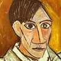
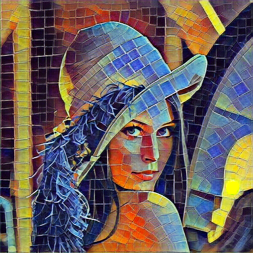

# ReCoNet

Image style transfer models based on convolutional neural networks usually suffer from high temporal inconsistency when applied to videos. Some video style transfer models have been proposed to improve temporal consistency, yet they fail to guarantee fast processing speed, nice perceptual style quality and high temporal consistency at the same time. In this paper, we propose a novel real-time video style transfer model, ReCoNet, which can generate temporally coherent style transfer videos while maintaining favorable perceptual styles. A novel luminance warping constraint is added to the temporal loss at the output level to capture luminance changes between consecutive frames and increase stylization stability under illumination effects. We also propose a novel feature-map-level temporal loss to further enhance temporal consistency on traceable objects. Experimental results indicate that our model exhibits outstanding performance both qualitatively and quantitatively.

## Pretrained model

We totally prepared 8 pretrained models of 8 different styles. You can download them from [here](https://download.mindspore.cn/vision/reconet/). The model and its style image are shown below.  

After download, you can use them as steps in the infer section.

| Model name           | Style file name  | Image                                | ckpt                                                                                        |
|----------------------|------------------|--------------------------------------|---------------------------------------------------------------------------------------------|
| reconet_autoportrait | autoportrait.jpg |  | [ckpt](https://download.mindspore.cn/vision/reconet/autoportrait/reconet_autoportrait.ckpt) |
| reconet_candy        | candy.jpg        |          | [ckpt](https://download.mindspore.cn/vision/reconet/candy/reconet_candy.ckpt)               |
| reconet_composition  | composition.jpg  |  | [ckpt](https://download.mindspore.cn/vision/reconet/composition/reconet_composition.ckpt)   |
| reconet_edtaonisl    | edtaonisl.jpg    |  | [ckpt](https://download.mindspore.cn/vision/reconet/edtaonisl/reconet_edtaonisl.ckpt)       |
| reconet_mosaic       | mosaic.jpg       |    | [ckpt](https://download.mindspore.cn/vision/reconet/mosaic/reconet_mosaic.ckpt)             |
| reconet_mosaic_2     | mosaic_2.jpg     |    | [ckpt](https://download.mindspore.cn/vision/reconet/mosaic_2/reconet_mosaic_2.ckpt)         |
| reconet_starry_night | starry_night.jpg |  | [ckpt](https://download.mindspore.cn/vision/reconet/starry_night/reconet_starry_night.ckpt) |
| reconet_udnie        | udnie.jpg        |          | [ckpt](https://download.mindspore.cn/vision/reconet/udnie/reconet_udnie.ckpt)               |

Here is a brief summary of all infer results. For each pair, top image is infer result and bottom is style image.


Here is an example of video infer result, style file is candy.jpg:

Video test file:


Video infer result:


## Training Parameter description

| Parameter      | Default      | Description                                                                                                      |
|:---------------|:-------------|:-----------------------------------------------------------------------------------------------------------------|
| device_target  | GPU          | Device type                                                                                                      |
| vgg_ckpt       | None         | Path of the vgg16 checkpoint file                                                                                |
| style_file     | None         | Location of style image                                                                                          |
| monkaa         | None         | Path of the monkaa dataset                                                                                       |
| flyingthings3d | None         | Path of the flyingthings3d dataset                                                                               |
| ckpt_dir    | ./           | Save path for ckpt file                                                                                          |
| output_ckpt    | reconet.ckpt | Save name for ckpt file                                                                                          |
| epochs         | 2            | Number of epochs                                                                                                 |
| learning_rate  | 0.001        | Value of learning rate                                                                                           |
| alpha          | 1e4          | Weight of content loss                                                                                           |
| beta           | 1e5          | Weight of style loss |
| gamma          | 1e-5         | Weight of total variation                                                                                        |
| lambda_f       | 1e5          | Weight of feature temporal loss                                                                                  |
| lambda_o       | 2e5          | Weight of output temporal loss                                                                                   |

Note: If you are training on Ascend platform, you may need to modify training parameter depends on your style image. Here, we provide a suggested parameters alpha = 1e5, beta = 1e3.

## Example

Here, we will introduce how to do train and infer with ReCoNet model.

### Dataset

At first, you need to download required dataset. ReCoNet uses Monkaa and Flyingthings3d dataset which can be downloaded at [here](https://lmb.informatik.uni-freiburg.de/resources/datasets/SceneFlowDatasets.en.html).

For both dataset, you only need RGB images(finalpass), Optical flow, Motion boundaries three parts. You can just download highlight part in following screeshot.


After download, you will get 6 tar.gz2 files, 3 for each dataset. Unzip all of them and make sure your path looks like this:

```text

.datasets/
    └── Monkaa
    |    ├── frames_finalpass
    |    ├── motion_boundaries
    |    └── optical_flow
    └── Flyingthings3d
         ├── frames_finalpass
         ├── motion_boundaries
         └── optical_flow


```

### VGG16 pretrain model

ReCoNet needs VGG pretrain model to get image encoded features.

You can get our prepared model from [here](https://download.mindspore.cn/vision/reconet/vgg16_for_reconet.ckpt). Please notice, this vgg16 model is pruned and only contains necessary parameters for ReCoNet. You can also get pretrained vgg16 model from [model zoo](https://download.mindspore.cn/model_zoo/master/).

Attention, different VGG16 model will have different encoded result, that means you need to change train parameters depend on your VGG16 pretrain model. For our provided pretrain model, you can just use  default parameters. If you use vgg16_withbn_ascend_v130_imagenet_official_cv_bs64.ckpt from model zoo, according to our experiment, you can use following parameters:

| Parameter     | Value | Description                  |
|:--------------|:------|:-----------------------------|
| alpha         | 1e5   | content loss weight          |
| beta          | 1e5   | style loss weight            |
| gamma         | 1e-5  | total variation weight       |
| lambda_f      | 1e5   | feature temporal loss weight |
| lambda_o      | 2e5   | output temporal loss weight  |
| learning_rate | 0.001 | learning rate                |

As for other vgg16 models, you need to tune parameter by yourself. Here are some clues:

Normally, alpha and beta are key parameters. Lambda_f and lambda_o are used to control the temporal invariant, not related to transfer result. Thus, you do not need to change them at first.

If loss value is bigger than our default model and your final infer result lose both style and content, you can modify the learning rate to a larger value(like 0.01) to make model restrain faster. Then check whether the result is fine now, or at least one of content or style is acceptable. if so, you can try following clues.

If your final infer result lose some part of the image, but style looks fine the style image, you can just modify alpha to a larger value(depend on how many content lost).

If your final infer result is not like style image, but content is fine, you can just modify beta to a larger value(depend on how many style lost)

### Train Model

Run the train.py to start to train the model. You need to replace {param} in following command to real value.

--style_file is the path of your style image  

--monkaa and --flyingthings3d are the path of training dataset, it should look like "./dataset/Monkaa"  

--vgg_ckpt is the path of vgg16 ckpt file  

--ckpt_dir is the path for saving trained model. Please make sure the whole path is existed

--output_ckpt is the name of trained model, it must have a suffix '.ckpt'

```shell
python train.py --style_file {style_file} --monkaa {monkaa} --flyingthings3d {flyingthings3d} --vgg_ckpt {vgg.ckpt} --ckpt_dir {ckpt_dir} --output_ckpt {output.ckpt}
```

output:

```shell
Epoch: [0 / 2], step: [0 / 32723], loss: 782203.9, time:  669.696 ms
```

Command also supports setting training parameters. For more detail, you can use following command:

```shell
python train.py -h
```

### Infer

At last, you can use your own image or video to test your model.

Prepare your own input first, and use following command:

--input_file is the input image or video file for infer. For image, we support most common image types(jpg, png). For video, we suggest to use mp4 as input

--ckpt_file is name of trained model for infer, it should have a suffix '.ckpt'

--output_file is the output file name.

--infer_mode do infer for image or video. Its value must be video or image. If you want to do video infer, please make sure opencv is available

Same as training, you need to replace {param} in following command to real value.

```shell
python infer.py --input_file {input.png} --ckpt_file {model.ckpt} --output_file {output.png} --infer_mode {video/image}
```

The transfer result image will be saved to {output_file} parameter.

**Result**

Style file:


Image test file:


Image infer result:


