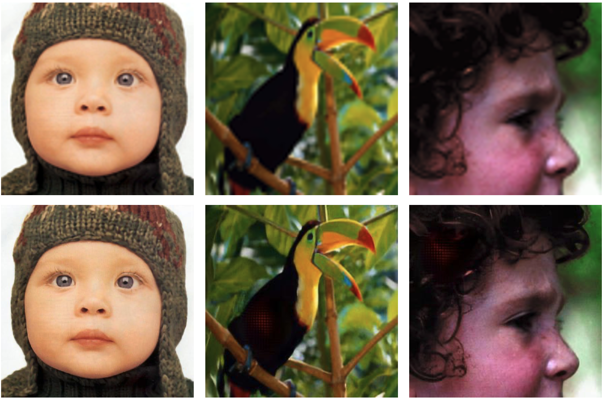

# SRGAN

Despite the breakthroughs in accuracy and speed of single image super-resolution using faster and deeper convolutional neural networks, one central problem remains largely unsolved: how do we recover the finer texture details when we super-resolve at large upscaling factors? The behavior of optimization-based super-resolution methods is principally driven by the choice of the objective function.Recent work has largely focused on minimizing the mean squared reconstruction error. The resulting estimates have high peak signal-to-noise ratios, but they are often lacking high-frequency details and are perceptually unsatisfying in the sense that they fail to match the fidelity expected at the higher resolution. In this paper, we present SRGAN,a generative adversarial network (GAN) for image superresolution (SR). To our knowledge, it is the first framework capable of inferring photo-realistic natural images for 4× upscaling factors. To achieve this, we propose a perceptualloss function which consists of an adversarial loss and a content loss. The adversarial loss pushes our solution to the natural image manifold using a discriminator network that is trained to differentiate between the super-resolved images and original photo-realistic images. In addition, we use a content loss motivated by perceptual similarity instead of similarity in pixel space. Our deep residual network is able to recover photo-realistic textures from heavily downsampled images on public benchmarks.

[Paper](https://arxiv.org/pdf/1609.04802.pdf): Christian Ledig, Lucas thesis, Ferenc Huszar, Jose Caballero, Andrew Cunningham, Alejandro Acosta, Andrew Aitken, Alykhan Tejani, Johannes Totz, Zehan Wang, Wenzhe Shi Twitter.

## Pretrained model

Model trained by MindSpore, the process of training SRGAN needs a [pretrained VGG19](https://download.mindspore.cn/model_zoo/converted_pretrained/vgg/) based on Imagenet.

|  Type  |  ckpt  |
| ------- | ------ |
| srgan |[ckpt](https://download.mindspore.cn/vision/srgan/) |

## Dataset

There are 3 datasets for training, validating and evaluating.

Attention, for DIV2K dataset, you only need 'Train Data (HR images)' and 'train Data Track 1 bicubic downscaling x4 (LR images)' these two datasets.

|  Type  |  Resource  |
| ------- |  ----------  |
| DIV2K | [link](https://data.vision.ee.ethz.ch/cvl/DIV2K/) |
| Set5 |[link](https://github.com/jbhuang0604/SelfExSR) |
| Set14 |[link](https://github.com/jbhuang0604/SelfExSR) |

Make sure your file organization is as following:

```markdown
.datasets/
    └── DIV2K
    |    ├── HR
    |    └── LR
    └── Set5
    |    ├── HR
    |    └── LR
    └── Set14
         ├── HR
         └── LR
```

## Training Parameter description

| Parameters                 | Default                       | Description                   |
| -------------------------- | ---------------------------------|---------------------------------------------|
| train_LR_path | None    | Path of low resolution image of training set |
| train_GT_path | None    | Path of high resolution image of training set |
| val_LR_path   | None    | Path of low resolution image of validation set |
| val_GT_path   | None    | Path of high resolution image of validation set |
| vgg_ckpt      | None    | Path of pretrained vgg19 model |
| image_size    | 96    | Image size of high resolution image |
| train_batch_size  | 16    | Batch size for training stage |
| val_batch_size     | 1    | Batch size for validation stage |
| psnr_epochs       | 2000    | Number of epochs in psnr training stage |
| gan_epochs       | 1000    | Number of epochs in gan training stage |
| init_type        | normal    | The method used in network initialization |
| platform | Ascend    | Platform used in training stage |
| run_distribute | 0    | Distributed training |
| device_num | 1    | Number of devices |

## Performance

### Training Performance

| Dataset | Resource | Speed |
|:------- |:---------|:------|
| DIV2K |Ascend 910|1pc: 540 ms/step; 8pcs: 1500 ms/step|
| DIV2K |NVIDIA GeForce RTX 3090|1pc: 350 ms/step|

### Evaluation Performance

| Dataset | Resource | PSNR | PSNR(Paper)|
| :-------------------|---------------------------------|--------------------------------|--------------------------------|
| Set5  | Ascend 910 | 31.00 | 29.40 |
| Set14 | Ascend 910  | 27.93 | 26.02 |

### Inference Performance

| Dataset | Resource | Speed |
| :------------------ | -------------------------|---------------------------------|
| Set5  | Ascend 910 | 1pc: 7 ms/step |
| Set14 | Ascend 910 | 1pc: 10 ms/step |

## Examples

### Training

Use DIV2K dataset for training, Set5 dataset for validation. You can change the path as needed.

Training result will be stored in './ckpt'.

  ```shell
  python -m src.train.train --train_LR_path './datasets/DIV2K/LR' --train_GT_path './datasets/DIV2K/HR' --val_LR_path './datasets/Set5/LR' --val_GT_path './datasets/Set5/HR' --vgg_ckpt './src/vgg19/vgg19.ckpt'
  ```

**Output**:

  ```text
  ...
   training 999 epoch
  per step needs time:356ms
  D_loss:
  0.6385005
  G_loss:
  0.009284813
   999/1000 epoch finished
  training 1000 epoch
  per step needs time:351ms
  D_loss:
  0.6633582
  G_loss:
  0.016534843
  saving ckpt
   1000/1000 epoch finished
  ```

### Distributed training

You can run './src/train/run_distribute_train.sh' to train your model in distributed environment.

  ```shell
  sh ./src/train/run_distribute_train.sh 8 1 /home/user/work/srgan_p/datasets/DIV2K/LR /home/user/work/srgan_p/datasets/DIV2K/HR /home/user/work/srgan_p/vgg19.ckpt /home/user/work/srgan_p/datasets/Set5/LR /home/user/work/srgan_p/datasets/Set5/HR
  ```

### Evaluation

You can run './src/eval.py' to evaluate the performance of your model.

  ```shell
  python -m src.eval --test_LR_path './datasets/Set5/LR' --test_GT_path './datasets/Set5/HR' --generator_path './ckpt/G_model_1000.ckpt'
  ```

**Output**:

  ```text
======load checkpoint
[WARNING] ME(3178:281473299786304,MainProcess):2022-08-28-14:22:01.705.760 [mindspore/train/serialization.py:674] For 'load_param_into_net', remove parameter generator.conv1.0.weight's prefix name: generator., continue to load it to net parameter conv1.0.weight.
=======starting test=====
avg PSNR: 30.997722005197154
  ```

### Inference

Inference result will be stored in './output'.

  ```shell
  python -m src.infer --test_LR_path './datasets/Set14/LR' --generator_path './ckpt/G_model_1000.ckpt'
  ```

**Output**:

  ```text
======load checkpoint
[WARNING] ME(3178:281473299786304,MainProcess):2022-08-28-14:22:01.705.760 [mindspore/train/serialization.py:674] For 'load_param_into_net', remove parameter generator.conv1.0.weight's prefix name: generator., continue to load it to net parameter conv1.0.weight.
=======starting test=====
Total 14 images need 134ms, per image needs 10ms.
Inference End.
  ```

**Result**:

