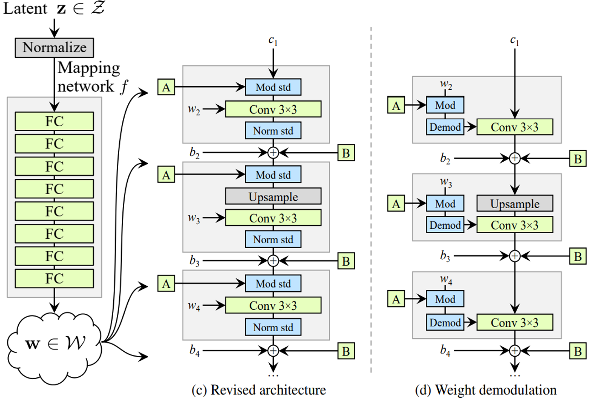
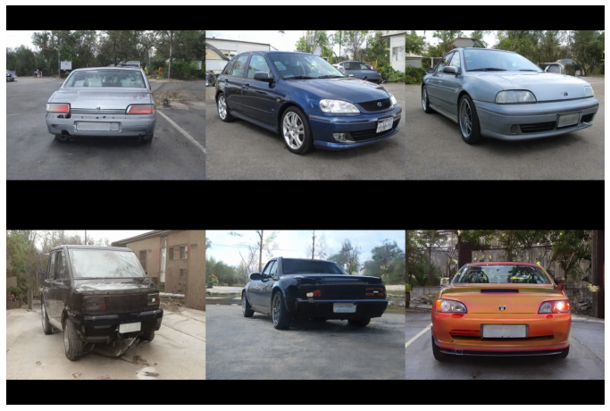

# StyleGAN2 -- A MindSpore Implementation

The style-based GAN architecture (StyleGAN) yields state-of-the-art results in data-driven unconditional generative image modeling. This paper exposes and analyzes several of its characteristic artifacts, and proposes changes in both model architecture and training methods to address them. In particular, this paper redesignes generator normalization, revisit progressive growing, and regularize the generator to encourage good conditioning in the mapping from latent vectors to images. In addition to improving image quality, this path length regularizer yields the additional benefit that the generator becomes significantly easier to invert. This makes it possible to reliably detect if an image is generated by a particular network. This paper furthermore visualizes how well the generator utilizes its output resolution, and identifies a capacity problem, motivating us to train larger models for additional quality improvements. Overall, this improved model redefines the state of the art in unconditional image modeling, both in terms of existing distribution quality metrics as well as perceived image quality.



For more details, please refer to the following paper:

Tero Karras, Samuli Laine, Miika Aittala, Janne Hellsten, Jaakko Lehtinen, Timo Aila. [Analyzing and Improving the Image Quality of StyleGAN](https://arxiv.org/pdf/1912.04958.pdf)\[J\]. arXiv:1912.04958, 2019.

## Requirements

* Only Linux is supported as MindSpore-GPU framework only supports Linux.
* 64-bit Python 3.7 and MindSpore 1.7.0.
* GPU with at least 16GB VRAM, CUDA 11.1.
* You might want to try Ascend 910 NPU on ModelArts Platform as MindSpore has been continuously optimized for Ascend NPU. Be aware that training is not working on Ascend 910 at the moment. Inference works well.

## Training parameters description

| Parameter | Default | Description |
|:-----|:---------|:--------|
| out_dir | ./output/ffhq/ | Output path |
| snap | 10 | Number of ticks within 1 network snapshot interval|
| device_target | GPU | Platform |
| device_id | 0 | Appoint specific device if more than 1 device exist|
| seed | 0 | Random seed |
| img_res | 1024 | Image resolution |
| data_dir | ../dataset/ffhq.zip | Training data |
| xflips | False | Images' horizontal flip |
| total_kimg | 25000 | Total number of images seen by discriminator in thousands |
| batch_size | 1 | Batch size |
| start_over | False | Start training from scratch |
| resume_train | None | Path to network snapshot ckpt |
| resume_paper | None| Path to pre-trained ckpt given by author of paper |

## Inferring parameters description

| Parameter | Default | Description |
|:-----|:---------|:--------|
| device_target | GPU | Platform |
| device_id | 0 | Appoint specific device if more than 1 device exist|
| ckpt | ./ckpt/G_ema.ckpt | Network checkpoint |
| seeds| 66,230,389,1518 | Seeds |
| truncation-psi | 0.5 | Truncation trick |
| num_layers | 8 | Number of mapping layers |
| img_res | 1024 | Image resolution |
| noise_mode | 1 | Noise mode |
| out_dir | ./generated_images | Output path |
| grid_size | None | Curate images in axb grid |

## Example

Below is the introduction of the usage of StyleGAN2.

### Preparation

First of all, download [FFHQ dataset folder](https://drive.google.com/drive/folders/1tZUcXDBeOibC6jcMCtgRRz67pzrAHeHL?usp=sharing) or [FFHQ dataset zip file](https://drive.google.com/file/d/1WvlAIvuochQn_L_f9p3OdFdTiSLlnnhv/view?usp=sharing) and save it in `./dataset/` directory.

Download Lsun Car dataset in zip format [here](http://dl.yf.io/lsun/objects/car.zip). After that, extract it to lmdb format and name it as `lsun_car_lmdb` which contains `data.mdb` and `lock.mdb`.

Next, you probably want to download the pre-trained models for inference purpose. Mindspore checkpoints can be downloaded from [here](https://download.mindspore.cn/vision/stylegan2/). Save these checkpoints in `./src/ckpt/ffhq` and `./src/ckpt/lsun_car_wide` directory.

After you make the preparation above, make sure your path is as following:

```text
./dataset/
    ├── ffhq.zip
    └── lsun_car.zip

./src/
    └── ckpt
    |    ├──ffhq
    |        ├── G.ckpt
    |        ├── G_ema.ckpt
    |        └── D.ckpt
    |    ├──lsun_car_wide
    |        ├── G.ckpt
    |        ├── G_ema.ckpt
    |        └── D.ckpt
```

### Dataset conversion

It is not a must to convert the FFHQ dataset from folders to zip if you have downloaded the dataset in folder.

Run `src/dataset_crop_zip.py` for the conversion from folder to zip.

```shell
cd stylegan2/src
python dataset_crop_zip.py --source=../dataset/ffhq/ --dest=../dataset/ffhq.zip
```

It is a must to convert the Lsun Car dataset from lmdb format to zip format before training.

Run `src/dataset_crop_zip.py` for the conversion from lmdb to zip.

```shell
python dataset_crop_zip.py --source=../dataset/lsun_car_lmdb --dest=../dataset/lsun_car.zip --transform=center-crop-wide --width=512 --height=384
```

### Inference

Run `infer.py` to generate fake human's face images curated in paper.

```shell
python infer.py --seed=66,1518,389,230 --ckpt=./ckpt/ffhq/G_ema.ckpt --img_res=1024 --truncation_psi=1
```


Run `infer.py` to generate fake car images curated in paper.

```shell
python infer.py --seed=6000-6005 --ckpt=./ckpt/lsun_car_wide/G_ema.ckpt --img_res=512 --truncation_psi=0.5
```



The output images are in the `out_dir` directory.

From the images shown above, we could tell that the performance of inferring images using MindSpore is on par with the images curated in the paper.

### Training

Run `train.py` to start training fake human's face model from scratch.

```shell
python train.py --data_dir=../dataset/ffhq.zip --batch_size=2 --start_over=True --xflips=True --out_dir=./output_ffhq
```

Run `train.py` to start training fake car model from scratch.

```shell
python train.py --data_dir=../dataset/lsun_car.zip --batch_size=4 --start_over=True --xflips=True --img_res=512 --out_dir=./output_lsun_car
```

Run `train.py` to resume ffhq training from network snapshot by which 22k images have been seen by discriminator.

```shell
python train.py --data_dir=../dataset/ffhq.zip --batch_size=2 --resume_train=./output_ffhq/network-snapshot-000022 --xflips=True --out_dir=./output_ffhq
```

Run `train.py` to resume lsun_car training from network snapshot by which 35k images have been seen by discriminator.

```shell
python train.py --data_dir=../dataset/lsun_car.zip --batch_size=4 --resume_train=./output_lsun_car/network-snapshot-000035 --xflips=True --out_dir=./output_lsun_car --img_res=512
```