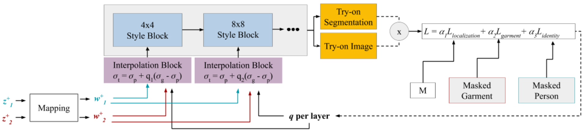
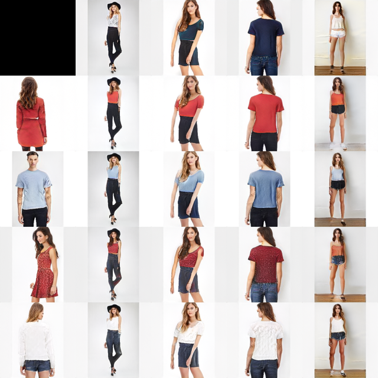

# VOGUE

Virtual try-on can visualize the clothes that people are interested in through calculation, enhance the shopping experience, and help reduce the environmental cost caused by overproduction and return. To this end, a new controllable image generation algorithm called VOGUE was proposed, which seamlessly integrated the personal designated parts in one image with the clothing shapes and details in another image. The specific method is as follows: firstly, a modified StyleGAN2 network is trained on 100,000 photos of 2D human posture, and then given a group of human images and clothing images, the best interpolation coefficient of each layer is calculated to generate a photo of the first input image of the person wearing the clothing from the second image. This task will realize the application of VOGUE with the help of Mindspore framework.

Please see more details in the following papers:

Original version:

Lewis K M, Varadharajan S, Kemelmacher-Shlizerman I. [Vogue: Try-on by stylegan interpolation optimization](https://arxiv.org/pdf/2101.02285v1.pdf)\[J\]. arXiv:2101.02285, 2021.

Final version:

Lewis K M, Varadharajan S, Kemelmacher-Shlizerman I. [TryOnGAN: Body-Aware Try-On via Layered Interpolation](https://arxiv.org/pdf/2101.02285.pdf)\[J\]. ACM Transactions on Graphics (TOG), 2021, 40(4): 1-10.



## Training parameters description

| Parameter | Default | Description |
|:-----|:---------|:--------|
| outdir | ./out/ | Results save path |
| gpus | 1 | Number of GPUs to use |
| snap | 1 | Snapshot interval |
| seed | 0 | Random seed |
| data_dir | ../dataset/data.zip | Training data |
| posefile | ./pose-annotations.csv | csv file of pose keypoints |
| mirror | False | Enable dataset x-flips |
| total_kimg | 25000 | Total training duration |
| batch_size | 2 | Total batch size |
| need_convert | False | Need to convert pkl to ms ckpt |
| model_path | ./ckpt/ | Path to save models |
| device | 0 | Device_id |

## Inferring parameters description (No pose)

| Parameter | Default | Description |
|:-----|:---------|:--------|
| ckpt | ./ckpt/G_ema_no_pose.ckpt | Network checkpoint |
| rows | 85,100,75,714 | Row seeds |
| cols | 33,821,1789,195 | Column seeds |
| col-styles | 0-6 | Style layer range |
| truncation-psi | 1 | Truncation psi |
| noise_mode | const | Noise mode |
| out_dir | ./out_mixing_no_pose | Output path |
| device | 0 | Device_id |

## Inferring parameters description

| Parameter | Default | Description |
|:-----|:---------|:--------|
| ckpt | ./ckpt/G_ema.ckpt | Network checkpoint |
| rows | 85,100,75,458,714 | Row seeds |
| cols | 55,821,1789,293 | Column seeds |
| col-styles | 0-6 | Style layer range |
| truncation-psi | 1 | Truncation psi |
| noise_mode | const | Noise mode |
| out_dir | ./out_mixing | Output path |
| pose_name | ./pose-annotations.csv | Pose file |
| data_path | ../dataset/inshopclothes/train/ | Data path |
| device | 0 | Device_id |

## Example

Below is the introduction of the usage of VOGUE.

### Preparation

At first, you should download the Inshop dataset from [Inshop](https://drive.google.com/file/d/1r_Pz2gk1Sp2sjYS7cj9oYUMbLGo9EyZS/view?usp=sharing) and save it in the `./dataset/` directory.

Second, you need to download the pose file [Pose keypoints](https://drive.google.com/file/d/1XryABeNxvzsdjEY7j4ed2m4G-we0n0md/view?usp=sharing) and save it in the `./src/` directory.

Third, you also have to download the pretrained models. The Pytorch model can be downloaded from [Trained Checkpoints](https://drive.google.com/drive/folders/1_GxdMeMDhGcFlGowQg10dANO1liS0v4Z?usp=sharing). However, these checkpoints cannot be directly used by Mindspore. The Mindspore checkpoints can be downloaded from [Generator_ema ckpt no pose](https://download.mindspore.cn/vision/vogue/G_ema_no_pose.ckpt), [Generator ckpt](https://download.mindspore.cn/vision/vogue/G.ckpt), [Generator_ema ckpt](https://download.mindspore.cn/vision/vogue/G_ema.ckpt), [Discriminator ckpt](https://download.mindspore.cn/vision/vogue/D.ckpt). Save these checkpoints in the `./src/ckpt/` directory.

After you make the preparation above, make sure your path is as following:

```text

./dataset/
    └── inshopclothes
    |    └── train
    |    |      ├── fashionMENDenimid0000008001_1front.jpg
    |    |      ├── fashionMENDenimid0000008001_2side.jpg
    |    |      ├── fashionMENDenimid0000008001_3back.jpg
    |    |           ......
./src/
    └── ckpt
    |    ├── G_ema_no_pose.ckpt
    |    ├── G.ckpt
    |    ├── G_ema.ckpt
    |    └── D.ckpt
    └── pose-annotations.csv
```

### Dataset conversion

Before you start to train or infer the model, it is necessary to convert the dataset from folders to zip.

Run `src/vogue_dataset_convert.py` to achieve this.

```shell
cd src
python vogue_dataset_convert.py --source=your/dataset/path/inshopclothes/ --dest=your/dataset/path/data.zip
```

### Infer model

Run `src/vogue_infer_no_pose.py` to infer the model when no pose file is considered.

```shell
python vogue_infer_no_pose.py --out-dir out_mixing_no_pose --rows 85,100,75,714 --cols 33,821,1789,195 --ckpt ckpt/G_ema_no_pose.ckpt --device 0
```

The output images are in the `out_dir` directory.

The performance of the output images are similar to the images in the paper.

You can also try to run `src/vogue_infer.py` to infer the model when the pose file is considered.

```shell
python vogue_infer.py --out-dir out_mixing --rows 85,100,75,458,1500 --cols 55,821,1789,293 --ckpt ckpt/G_ema.ckpt --pose-name pose-annotations.csv --data-path your/dataset/path/inshopclothes/train/ --device 0
```

However, the performance is not quite satisfying when using the pretrained model provided by the authors.

**Results**

Mindspore result:



Pytorch result:


Since the authors did not open source their codes, we cannot generate results that are completely the same with the images in the paper. Considering that the purpose of this project is to realize trying on, we have completed this function and obtained the results consistent with this function in the paper. The result in the paper is given below as a reference.

Result in the paper:


### Train model

Run `src/vogue_train.py` to train the model.

```shell
python vogue_train.py --outdir out --data-dir your/dataset/path/my_dataset.zip --posefile ./pose-annotations.csv --mirror 0 --model-path ./ckpt/ --device 0
```
